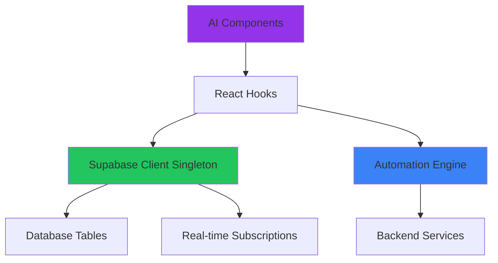
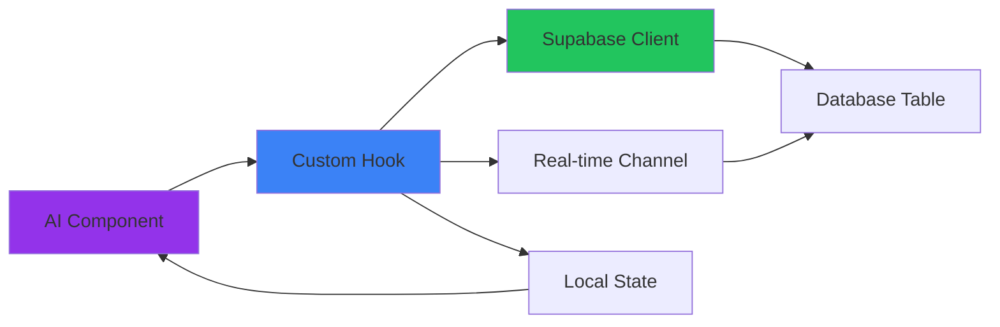
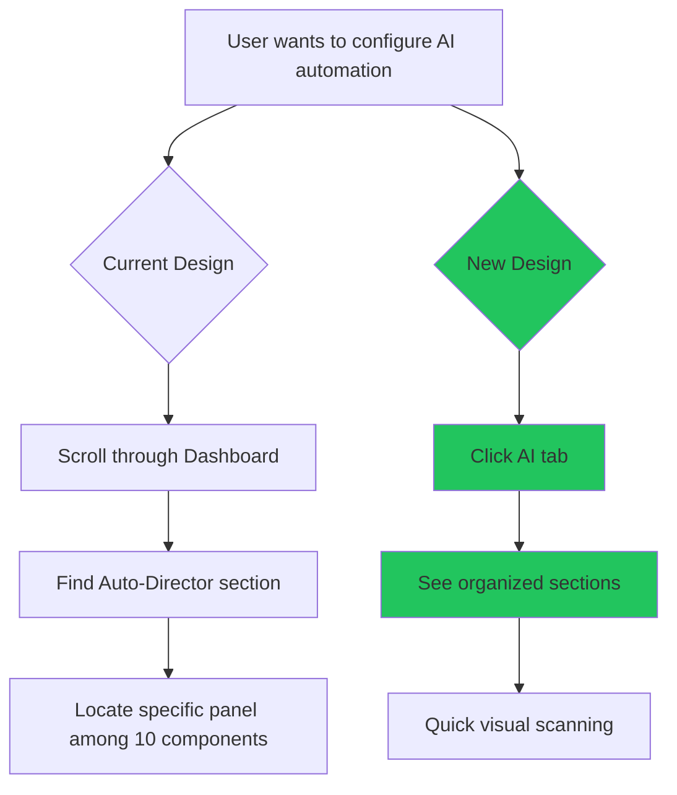

# AI Tab Restructuring Design

## Overview

This design document outlines the feasibility and strategy for restructuring the Stream Enhancement Dashboard to introduce a dedicated **AI Tab** alongside the existing Dashboard, Studio, and Media tabs. The goal is to consolidate AI automation and intelligence features into a single location while:
- Preserving core functionality (BetaBot control and TTS questions) in the main Dashboard for immediate access
- Keeping Studio AI tools in the Studio tab (music-specific AI features remain with music production)
- Creating a cleaner, more focused Dashboard

### Current State

The application currently has a three-tab navigation structure:
- **Dashboard**: Primary control hub with AI features embedded throughout
- **Studio**: Music production, DJ controls, and audio tooling
- **Media**: Video playback, media browser, and visual content management

AI features are currently dispersed across:
- **Main Dashboard**: AI Auto-Director system (10 components)
- **Show Management Section**: Producer AI Panel
- **Studio Tab**: AI DJ tools (4 components - will remain in Studio)

### Proposed State

Restructure to a four-tab navigation:
- **Dashboard**: Core production controls (BetaBot, TTS, overlays, segments) - streamlined and cleaner
- **Studio**: Music and audio production with AI DJ tools (unchanged)
- **Media**: Visual content management (unchanged)
- **AI** (NEW): Consolidated AI automation, analysis, and intelligence systems (production-focused AI only)

## Repository Type

**Full-Stack Application** (React Frontend + Node.js Backend + Supabase)
- Frontend: React with TypeScript, Vite
- Backend: Node.js services (audio, TTS, OBS integration)
- Database: Supabase (PostgreSQL with real-time subscriptions)
- Audio: Local backend service on port 3001

## Feasibility Analysis

### Will AI Features Still Work When Moved?

**YES** - All identified AI features will continue to function when relocated to a dedicated AI tab. This assessment is based on:

#### Architecture Independence
All AI components are built as self-contained React components that:
- Manage their own state via React hooks
- Connect to Supabase directly via the singleton client
- Subscribe to real-time database updates independently
- Do not have hard dependencies on their current UI location

#### Data Flow Preservation


The data flow is decoupled from UI structure:
- Components → Hooks → Services → Database
- Tab location does not affect data access
- Real-time subscriptions work across all tabs
- Automation engine runs independently of UI

#### State Management Strategy
The application uses context providers at the App root level:
- `AuthProviderWithBoundary`: User authentication (global)
- `ShowProviderWithBoundary`: Show state management (global)
- Component-level hooks: Feature-specific state

Since providers wrap the entire application, all tabs have equal access to shared state.

## AI Features Inventory

### Features to MOVE to AI Tab

#### 1. AI Auto-Director & Automation System
**Location**: Dashboard → "⚡ AI Auto-Director & Automation" section

Components to relocate:
- `AutomationConfigPanel` - Master automation settings and system status
- `OBSConnectionPanel` - OBS WebSocket integration for scene switching
- `TranscriptionPanel` - Live speech-to-text monitoring
- `AIAnalysisPanel` - Context analysis and AI decision engine
- `SuggestionApprovalPanel` - Review and approve AI suggestions
- `ExecutionHistoryPanel` - Automation action history log
- `AnalyticsDashboard` - Performance metrics and analytics
- `ManualTriggerPanel` - Manual production triggers
- `TriggerRulesPanel` - Automation rule configuration
- `AutomationFeedPanel` - Live automation event feed

**Dependencies**:
- Hook: `useAutomationEngine` (provides automation context)
- Services: OBS WebSocket, Supabase real-time
- Tables: `automation_config`, `automation_history`, `trigger_rules`

**Functionality**: Monitors live transcripts, analyzes context, suggests scene changes, automates production decisions

---

#### 2. Producer AI Panel
**Location**: Dashboard → "🎬 Show Management" section

Component: `ProducerAIPanel`

**Sub-features**:
- AI question generation and suggestion system
- Predictive intelligence dashboard
- Show plan management and timeline tracking
- Context memory and duplicate prevention
- Multi-model AI integration (OpenAI, Anthropic)

**Dependencies**:
- Hooks: `useProducerAI`, `usePredictiveAI`
- Contexts: `AuthContext`, `ShowContext`
- Tables: `show_plans`, `question_suggestions`, `producer_ai_config`

**Child Components**:
- `PredictionDashboard` - AI predictions and show health metrics
- `ImportPlanModal` - Import show plans from external sources
- `ShowPlanSelector` - Select and activate show plans
- `ShowPlanViewer` - View structured show timelines
- `AICoordinatorMonitor` - Monitor AI coordinator events

**Functionality**: Generates intelligent follow-up questions, tracks show flow, predicts engagement patterns

---

#### 3. Studio AI Tools (REMAIN IN STUDIO TAB)
**Location**: Studio Tab → "Tools" sub-tab

**Decision**: These components will **NOT** be moved to the AI tab. They remain in Studio because:
- They are music production-specific tools
- They integrate directly with the dual-deck audio player
- They are already in a well-organized sub-tab structure
- Moving them would reduce Studio functionality and increase AI tab complexity

Components staying in Studio:
- `AIChatPanel` - Conversational AI DJ assistant
- `AITrainingPanel` - Train AI on music selection preferences
- `AITransitionPanel` - AI-powered music transition suggestions
- `AIPlaybackIndicator` - Visual indicator for AI-controlled playback

**Dependencies**:
- Hook: `useAIDJ` (AI DJ decision engine)
- Services: Music library integration
- Tables: `ai_training_data`, `ai_music_preferences`

**Functionality**: AI-assisted music selection, intelligent transitions, learning from DJ preferences

---

### Features to KEEP in Dashboard

#### 1. BetaBot Control Panel
**Component**: `BetaBotControlPanel`
**Reason**: Core production tool requiring immediate access during live streaming

Features:
- Start/stop conversation sessions
- Manual voice activation (30-second listening mode)
- Text input for questions
- Real-time conversation log
- Wake phrase detection ("Beta Bot")

**Dependencies**:
- Hook: `useSpeechRecognition` (voice detection)
- Backend: Local TTS service on port 3001
- Table: `betabot_conversation_log`

---

#### 2. BetaBot Director Panel
**Component**: `BetaBotDirectorPanel`
**Reason**: Live show direction controls (mood, movement, incoming notifications)

Features:
- Mood control (neutral, bored, amused, spicy)
- Movement commands (home, run left/right, bounce, hide)
- Incoming notification toggle
- Manual override with duration control

**Dependencies**:
- Hook: `useAutomationEngine` (for mood management)
- Table: `betabot_mood`

---

#### 3. Question Banner Control
**Component**: `QuestionBannerControl`
**Reason**: TTS question display is a core live production element

Features:
- Display TTS-generated questions on stream overlay
- Real-time visibility toggle
- Database-driven content updates

**Dependencies**:
- Table: `question_banners`
- Real-time: Supabase subscriptions

---

## Proposed Tab Structure

### Dashboard Tab (Refined)
Focus: **Live Production Controls**

Sections:
1. **🎵 Global Music Player** (unchanged)
2. **▶️ Show Start** (unchanged)
   - Show Intro Controller
   - Show Metadata Control
   - Episode Info Panel
   - Overlay Grid
   - **BetaBot Director Panel** (kept)
   - Segment Control Panel
   - Popup Queue Panel
3. **🔴 Live Controls** (unchanged)
   - Audio Control Center
   - Quick Actions
   - **BetaBot Control Panel** (kept)
   - Scarlett Audio Panel
   - **Question Banner Control** (kept - TTS questions)
   - Lower Third Control
   - Soundboard Panel
4. **🎬 Show Management** (reduced)
   - Show Prep Panel
   - ~~Producer AI Panel~~ (moved to AI tab)
   - Broadcast Settings Panel
   - Operator Notes Panel
   - Bookmark Panel
   - Template Selector
   - Show History Panel

---

### Studio Tab (Unchanged)
Focus: **Music Production & DJ Controls**

Sub-tabs:
- **Music**: Dual deck, waveforms, library
- **FX**: Effects, filters, EQ
- **Recording**: Sampler, recorder, vinyl mode
- **Tools**: AI Chat, AI Training, AI Transitions, MIDI, Analytics, Scheduler (AI tools remain)
- **Advanced**: Professional mixing tools

**Rationale**: Studio AI tools are music production-specific and benefit from staying integrated with the audio engine.

---

### Media Tab (Unchanged)
Focus: **Visual Content Management**

Features:
- Global Music Player
- Video Player Control
- Media Browser

---

### AI Tab (NEW)
Focus: **AI Automation & Intelligence**

Proposed section structure:

#### Section 1: AI Core Systems
```
🤖 AI Core Systems
├─ AI Coordinator Monitor (live event stream)
├─ Automation Config Panel (master settings)
└─ OBS Connection Panel (scene integration)
```

#### Section 2: Producer Intelligence
```
🎯 Producer Intelligence
├─ Producer AI Panel (question generation & show planning)
│  ├─ Prediction Dashboard
│  ├─ Show Plan Selector
│  ├─ Show Plan Viewer
│  └─ Import Plan Modal
└─ Transcription Panel (live speech monitoring)
```

#### Section 3: Context & Analysis
```
🧠 Context & Analysis
├─ AI Analysis Panel (decision engine)
├─ Suggestion Approval Panel (review queue)
└─ Execution History Panel (action log)
```

#### Section 4: Automation Rules
```
⚙️ Automation Rules
├─ Trigger Rules Panel (rule configuration)
├─ Manual Trigger Panel (manual overrides)
└─ Automation Feed Panel (live feed)
```

#### Section 5: Analytics & Insights
```
📊 Analytics & Insights
└─ Analytics Dashboard (performance metrics)
```

~~#### Section 6: Studio AI (Music Intelligence)~~
**REMOVED** - Studio AI tools will remain in the Studio tab's Tools section.

---

## Component Architecture

### Tab Navigation Component
New tab button to be added to existing navigation:

```
Tab Navigation Structure:
┌─────────────┬─────────┬───────┬─────┐
│ Dashboard   │ Studio  │ Media │ AI  │
└─────────────┴─────────┴───────┴─────┘
     (red)      (purple)  (blue) (yellow)
```

Visual specification:
- Icon: Brain or Sparkles (from lucide-react)
- Color scheme: Yellow gradient (from-yellow-600 to-amber-600)
- Active state: Yellow border-b-2 with amber-400 accent
- Badge: "BETA" label with yellow background

### State Management Pattern
All AI components follow this pattern:



Pattern explanation:
1. Component imports custom hook (e.g., `useProducerAI`)
2. Hook manages local state and Supabase connection
3. Real-time subscriptions update state automatically
4. Component re-renders with new data
5. Tab location does not affect this flow

### Data Persistence Strategy
All AI systems use Supabase tables for persistence:

| Feature | Primary Table | Real-time? | State Sharing |
|---------|--------------|------------|---------------|
| Producer AI | `show_plans` | Yes | Global via ShowContext |
| Auto-Director | `automation_config` | Yes | Component-level |
| AI Analysis | `automation_history` | Yes | Component-level |
| Trigger Rules | `trigger_rules` | Yes | Component-level |
| BetaBot | `betabot_conversation_log` | Yes | Component-level |
| AI Training | `ai_training_data` | No | Component-level |

**Key Insight**: Since all state is persisted in Supabase with real-time subscriptions, components can be moved freely without breaking functionality. The database acts as the source of truth, not the UI hierarchy.

## Migration Strategy

### Phase 1: UI Structure Changes
1. Add AI tab to navigation bar in `App.tsx`
2. Create new conditional render block for `activeTab === 'ai'`
3. Copy AI component imports (no changes to components themselves)
4. Update tab styling with yellow/amber color scheme

### Phase 2: Component Relocation
Move components in this order to maintain functionality:

**Step 1**: Move AI Auto-Director section (lowest risk)
- All 10 components are self-contained
- No dependencies on Dashboard-specific state
- Real-time subscriptions work independently

**Step 2**: Move Producer AI Panel (medium risk)
- Verify `ShowContext` is still accessible
- Test show plan persistence across tabs
- Confirm timer state preservation

**Step 3**: Remove moved components from original locations
- Delete from Dashboard render
- Delete from Studio render
- Clean up unused imports

### Phase 3: Testing Strategy
Verify each moved feature works correctly:

#### Test 1: Producer AI Cross-Tab Functionality
1. Navigate to AI tab
2. Activate show plan with timer
3. Switch to Dashboard tab
4. Verify timer continues running in background
5. Switch back to AI tab
6. Confirm state is preserved (current segment, elapsed time)

**Expected Result**: Timer and show plan state persist across tab switches due to localStorage and Supabase synchronization

---

#### Test 2: Real-time Subscription Continuity
1. Open two browser windows (Window A and Window B)
2. Window A: Navigate to Dashboard
3. Window B: Navigate to AI tab → Automation Config Panel
4. Window B: Toggle automation enabled/disabled
5. Window A: Verify automation status updates in real-time
6. Window B: Add new trigger rule
7. Window A: Verify rule appears in relevant panels

**Expected Result**: Real-time updates work across tabs and windows

---

#### Test 3: BetaBot Control Isolation
1. Navigate to Dashboard
2. Start BetaBot session
3. Switch to AI tab (BetaBot should continue)
4. Navigate to Studio tab
5. Use soundboard effects
6. Return to Dashboard
7. Verify BetaBot session still active

**Expected Result**: BetaBot session persists across tab navigation, audio playback unaffected

---

#### Test 4: AI Analysis Background Processing
1. Navigate to AI tab
2. Enable AI Automation
3. Start transcription monitoring
4. Switch to Dashboard tab
5. Use BetaBot to generate conversation
6. Switch back to AI tab
7. Verify AI Analysis has processed transcript
8. Check Execution History for logged actions

**Expected Result**: AI processing continues in background, updates visible when returning to AI tab

---

#### Test 5: Studio AI Isolation (Unchanged)
1. Navigate to Studio tab
2. Load music track
3. Navigate to AI tab
4. Enable AI automation
5. Navigate back to Studio tab
6. Verify Studio AI tools still functional
7. Use AI Chat Panel for transition suggestion
8. Verify music player state unchanged

**Expected Result**: Studio AI tools continue working independently, unaffected by AI tab features

---

## Technical Considerations

### Browser Tab Visibility API
When user switches browser tabs (not application tabs), some features may pause:

**Affected Features**:
- Background music playback (may pause in some browsers)
- Timer intervals (may throttle to save resources)
- Real-time subscriptions (Supabase maintains connections)

**Mitigation Strategy**:
- Use `document.visibilityState` API to detect tab focus
- Persist critical state (timers, playback position) to localStorage
- Re-sync on tab focus using timestamp-based calculations

Example pattern:
```
User Actions:
1. AI tab active, show timer running (e.g., 15 minutes elapsed)
2. User switches to Dashboard tab (application tab switch - no issue)
3. User switches to different browser tab (browser tab switch)
4. Browser may throttle background timers
5. User returns to browser tab
6. Timer re-syncs using start timestamp: current_time - start_time = accurate elapsed time
```

### Performance Impact
Adding a fourth tab has minimal performance impact:

- React only renders active tab content (conditional rendering)
- Inactive components are unmounted (no memory overhead)
- Real-time subscriptions remain active (Supabase manages efficiently)
- Background state updates via React context triggers re-renders only for subscribed components

### Database Schema Impact
**NO DATABASE CHANGES REQUIRED**

This is purely a UI/UX restructuring. All existing Supabase tables remain unchanged:

| Table | Purpose | Real-time? | Used By |
|-------|---------|------------|----------|
| `automation_config` | AI automation settings | Yes | AI Auto-Director |
| `automation_history` | Action execution log | Yes | Execution History |
| `trigger_rules` | Production trigger rules | Yes | Trigger Rules |
| `show_plans` | Producer AI show plans | Yes | Producer AI |
| `betabot_conversation_log` | BetaBot transcripts | Yes | BetaBot Control |
| `betabot_mood` | BetaBot mood/movement state | Yes | BetaBot Director |
| `question_banners` | TTS question display | Yes | Question Banner |
| `ai_training_data` | AI DJ training data | No | Studio AI (stays in Studio) |
| `ai_music_preferences` | AI music selection data | No | Studio AI (stays in Studio) |
| `show_metadata` | Show configuration | Yes | Show Metadata Control |

**Key Points**:
- All tables already exist in the current schema
- No new columns or indexes needed
- No migrations required
- Real-time subscriptions use existing channels
- Row Level Security (RLS) policies remain unchanged

**Why No Changes Needed**:
1. Components are being moved, not modified
2. Data access patterns remain identical
3. Supabase client is a singleton (shared across tabs)
4. Real-time subscriptions are location-agnostic
5. Database structure supports the UI reorganization without modification

### Backward Compatibility
To support gradual rollout or rollback:

**Feature Flag Approach**:
Environment variable controls whether AI tab is visible:
```
VITE_ENABLE_AI_TAB=true  → Show AI tab, hide AI components from Dashboard/Studio
VITE_ENABLE_AI_TAB=false → Hide AI tab, show AI components in original locations
```

This allows:
- Testing in development before production deployment
- A/B testing with different user groups
- Quick rollback if issues discovered
- Graceful migration period

## User Experience Considerations

### Navigation Flow Optimization

**Current User Pain Point**:
AI features scattered across multiple sections creates cognitive load. Users must scroll through long Dashboard to find automation controls.

**Improved Flow with AI Tab**:


### Tab Switching Performance
Tab switches should feel instant:

- **Target**: < 100ms perceived switch time
- **Implementation**: Conditional rendering (React already optimized)
- **Measurement**: Monitor React DevTools Profiler
- **Optimization**: Lazy load heavy components if needed

### Accessibility Improvements
New AI tab follows existing patterns:

- Keyboard navigation: `Tab` key to cycle through tabs
- Shortcut potential: `Alt+4` for AI tab (following Alt+1/2/3 pattern)
- Screen reader: "AI Tab, Beta" announcement
- Focus management: Preserve focus when switching between tabs

## Risks and Mitigations

### Risk 1: State Loss During Tab Switch
**Probability**: Low  
**Impact**: Medium  

**Scenario**: User has active show plan timer, switches tabs, timer resets

**Mitigation**:
- Persist timer state to localStorage on every update
- Use timestamp-based calculations (not interval-based)
- Re-sync on tab focus using `useEffect` with visibility detection

---

### Risk 2: Real-time Subscription Conflicts
**Probability**: Very Low  
**Impact**: High  

**Scenario**: Multiple tabs subscribe to same Supabase channel, causing duplicate updates

**Mitigation**:
- Supabase client is a singleton (shared across components)
- Channel subscriptions are idempotent (safe to call multiple times)
- React strict mode already tests this scenario in development

---

### Risk 3: User Confusion About Feature Location
**Probability**: Medium  
**Impact**: Low  

**Scenario**: Users accustomed to AI features in Dashboard can't find them

**Mitigation**:
- Add "Moved to AI Tab →" placeholder messages in original locations (temporary)
- Include onboarding tooltip on first AI tab visit
- Update documentation and quickstart guides
- Provide search functionality to locate features

---

### Risk 4: Increased Cognitive Load
**Probability**: Low  
**Impact**: Low  

**Scenario**: Four tabs instead of three feels overwhelming

**Mitigation**:
- Use clear visual hierarchy with color coding
- Add descriptive icons (Brain/Sparkles for AI)
- Include "BETA" badge to set expectations
- Monitor user feedback and analytics

---

## Success Criteria

The AI tab restructuring will be considered successful when:

### Functional Requirements
- [ ] All AI features functional after move (100% feature parity)
- [ ] Real-time updates work across all tabs
- [ ] BetaBot and TTS questions remain in Dashboard
- [ ] No regressions in existing Dashboard/Studio/Media tabs
- [ ] State persists correctly across tab switches
- [ ] Background processing continues when AI tab not active

### Performance Requirements
- [ ] Tab switch latency < 100ms
- [ ] No increase in initial page load time
- [ ] Real-time subscription overhead < 5% CPU
- [ ] Memory usage stable across extended sessions

### User Experience Requirements
- [ ] Users can locate AI features within 10 seconds
- [ ] No reported confusion about feature locations
- [ ] Positive feedback on organization and clarity
- [ ] Reduced scrolling on Dashboard (target: 30% reduction)

## Conclusion

**FEASIBILITY VERDICT: FULLY VIABLE**

Moving AI automation features to a dedicated tab is architecturally sound and will improve the user experience without compromising functionality. The system's architecture supports this restructuring because:

1. **Decoupled Architecture**: Components use hooks and Supabase subscriptions, not direct parent-child dependencies
2. **Global State Management**: Context providers at App root level accessible from all tabs
3. **Database as Source of Truth**: All state persisted in Supabase, not React component hierarchy
4. **Real-time Synchronization**: Updates propagate regardless of UI location
5. **Proven Pattern**: Music player already works across all tabs using same architecture
6. **No Database Changes**: Zero migration risk - purely a UI reorganization

**SCOPE CLARIFICATION**:
- **Moving to AI Tab**: AI Auto-Director (10 components) + Producer AI Panel
- **Staying in Dashboard**: BetaBot Control, BetaBot Director, TTS Question Banner
- **Staying in Studio**: All Studio AI tools (AI Chat, AI Training, AI Transitions, AI Playback Indicator)

**RECOMMENDED APPROACH**: Implement in phases with feature flag for controlled rollout. Begin with AI Auto-Director section (lowest risk), followed by Producer AI Panel.

**TIMELINE ESTIMATE**:
- Phase 1 (UI Structure): 2-3 hours
- Phase 2 (Component Relocation - Dashboard AI only): 3-4 hours
- Phase 3 (Testing & Refinement): 3-5 hours
- **Total**: 8-12 hours of development work

**NEXT STEPS**:
1. Review and approve this design document
2. Create feature flag environment variable (`VITE_ENABLE_AI_TAB`)
3. Implement Phase 1 (tab structure)
4. Test with BetaBot and TTS to ensure core features unaffected
5. Migrate AI Auto-Director components first (lowest risk)
6. Migrate Producer AI Panel second
7. Conduct comprehensive testing across all scenarios
8. Deploy with monitoring for real-time feedback
