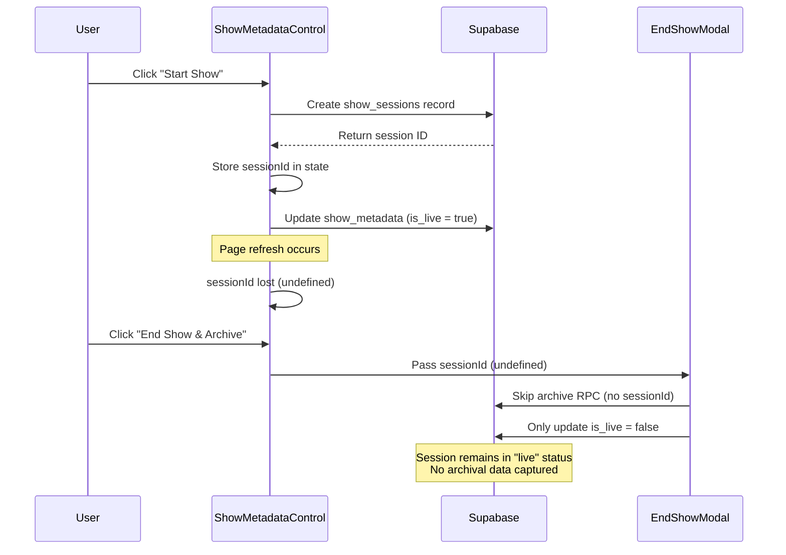
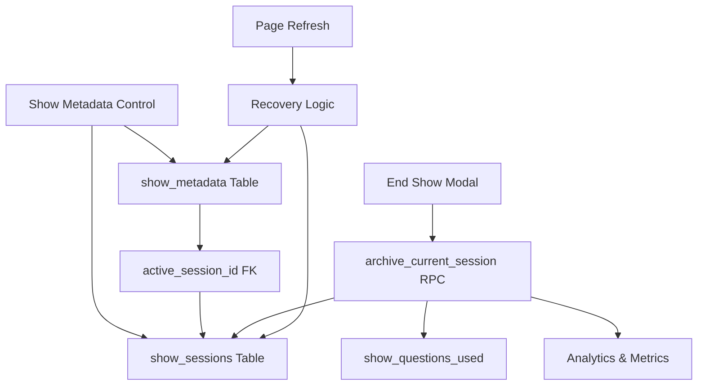
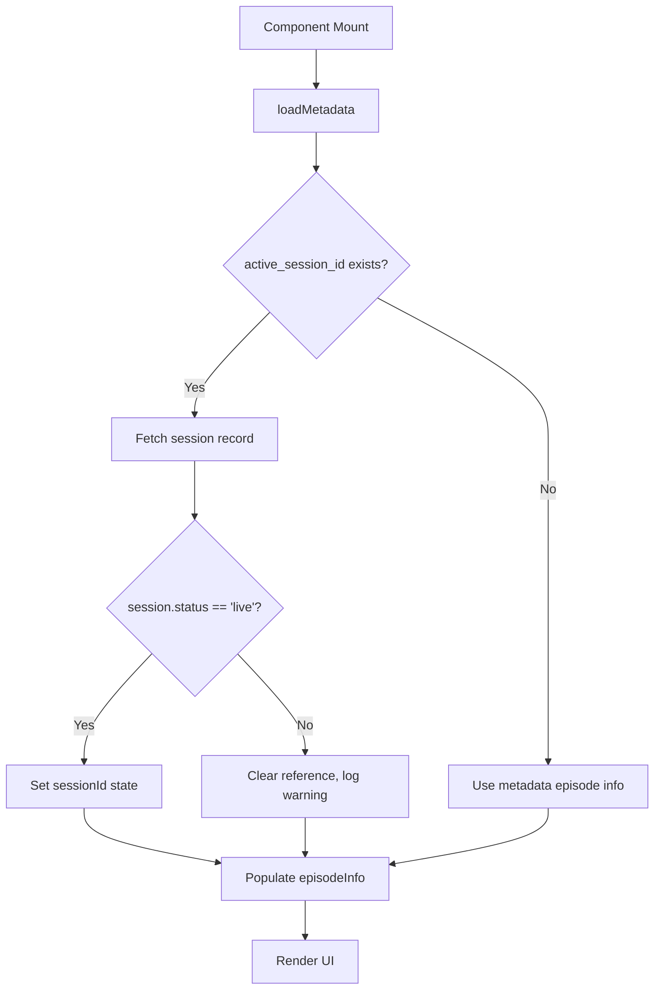

# Show Start/End Logic Fix & Enhancement Design

## Overview

The Show Metadata Control component manages live broadcast state transitions through a multi-stage workflow. Currently, the "Start Show" button creates a session and sets the show live, but the "End Show & Archive" button does not properly complete the session archival process, leading to incomplete state management and potential data loss.

## Problem Statement

### Current Issues

1. **Incomplete Session Lifecycle**: The `startShow()` function creates a `show_sessions` record but stores the session ID only in component state. When the component unmounts or the page refreshes, this session ID is lost.

2. **Broken End Show Flow**: The "End Show & Archive" button receives `sessionId` from props, but this value is `undefined` after page refresh, preventing proper archival.

3. **Missing State Persistence**: There is no persistent link between the active show session and the `show_metadata` table, causing a disconnect between show state and session data.

4. **No Session Recovery**: If the user refreshes the page during a live show, there is no mechanism to recover the active session ID.

5. **Incomplete Archival**: The `EndShowModal` attempts to call `archive_current_session` RPC but fails silently when `sessionId` is undefined, leaving sessions in "live" status permanently.

## Root Cause Analysis



## Solution Design

### Strategic Objectives

1. **Persist Active Session**: Link the active session to `show_metadata` for state recovery
2. **Guarantee Session Closure**: Ensure all shows properly archive sessions on end
3. **Enable State Recovery**: Support page refresh without losing active session context
4. **Improve User Feedback**: Provide clear status indicators for session state
5. **Enhance Error Handling**: Gracefully handle edge cases and failures

### Architecture Overview



## Data Model Enhancement

### Modified show_metadata Schema

Add a foreign key reference to track the active session:

| Column Name | Type | Purpose | Constraints |
|------------|------|---------|-------------|
| active_session_id | uuid | References the current live session | FOREIGN KEY → show_sessions(id), NULL when not live |

### Workflow State Transitions

| State | is_live | active_session_id | show_start_time | Description |
|-------|---------|-------------------|-----------------|-------------|
| **Idle** | false | NULL | NULL | No show running |
| **Live** | true | {session-uuid} | {timestamp} | Show in progress |
| **Archived** | false | NULL | NULL | Show ended and archived |
| **Error** | false | {session-uuid} | {timestamp} | Live flag off but session not closed |

## Functional Requirements

### FR-1: Start Show Enhancement

**Behavior**: When the user clicks "Start Show" and confirms:

1. Create a new `show_sessions` record with status = 'live'
2. Update `show_metadata` to set:
   - `is_live = true`
   - `show_start_time = current timestamp`
   - `active_session_id = new session ID`
3. Store session ID in component state for immediate use
4. Broadcast state change via real-time subscription

**Success Criteria**:
- Session ID is persisted in database
- Status display shows "🔴 LIVE"
- Session is recoverable after page refresh

### FR-2: End Show Enhancement

**Behavior**: When the user clicks "End Show & Archive":

1. Retrieve `active_session_id` from `show_metadata`
2. If session exists, call `archive_current_session(active_session_id)` RPC
3. Save user-provided show notes to the session
4. Update `show_metadata` to set:
   - `is_live = false`
   - `is_rehearsal = false`
   - `active_session_id = NULL`
5. Display success confirmation
6. Reset component state

**Success Criteria**:
- Session status changes from 'live' to 'archived'
- All show data (questions, bookmarks, analytics) is preserved
- Modal displays success message and auto-closes
- Session appears in Show History panel

### FR-3: Session Recovery Logic

**Behavior**: When component mounts or `loadMetadata()` is called:

1. Fetch `show_metadata` including `active_session_id`
2. If `active_session_id` exists, fetch corresponding session from `show_sessions`
3. Verify session status is 'live'
4. Populate component state with recovered session ID and episode info
5. If session is orphaned (status != 'live'), log warning and clear reference

**Success Criteria**:
- Page refresh during live show preserves session context
- User can click "End Show" after refresh and properly archive
- Orphaned sessions are detected and cleaned up

### FR-4: Reset Show Enhancement

**Behavior**: When the user clicks "Reset Show" and confirms:

1. Check if `active_session_id` exists
2. If exists, prompt user: "Active session detected. Archive first?"
   - Option A: Archive and reset
   - Option B: Discard session and reset (destructive)
3. Update `show_metadata` to clear all state:
   - `show_start_time = NULL`
   - `total_elapsed_seconds = 0`
   - `is_live = false`
   - `active_session_id = NULL`

**Success Criteria**:
- User is warned before discarding active sessions
- Reset operation leaves database in clean idle state
- No orphaned sessions remain

## User Interface Enhancements

### Status Display Improvements

**Current Status Section**:
- Add "Active Session" indicator when `active_session_id` exists
- Display session duration in real-time
- Show episode info from active session
- Add visual warning for orphaned sessions

**Example Status Display**:

| Label | Value | Visual Treatment |
|-------|-------|------------------|
| Show Status | 🔴 LIVE | Red badge with pulse animation |
| Mode | ✓ PRODUCTION | Green badge |
| Start Time | Oct 20, 09:23 AM | Gray text |
| Active Session | Episode #42 - "Tech Talk" | Blue badge with session icon |
| Session Duration | 01:23:45 | Monospace font, live updating |

### Button State Logic

| Button | Enabled When | Disabled When | Purpose |
|--------|--------------|---------------|---------|
| **Start Show** | is_live = false AND active_session_id = NULL | is_live = true OR active_session_id exists | Begin new show session |
| **End Show & Archive** | is_live = true OR active_session_id exists | Both are false | Complete and archive session |
| **Reset Show** | Always enabled | Never | Clear all show state |
| **Live Toggle** | Always enabled | Never | Quick live status flip |

### Enhanced Confirmation Dialogs

**Start Show Confirmation**:
- Title: "Start the show now?"
- Message: "This will create a new session and go LIVE"
- Show episode info preview
- Buttons: "Confirm Start" (green) | "Cancel" (gray)

**End Show Confirmation** (via Modal):
- Title: "End Show - Episode #{number}"
- Episode summary card
- Show notes textarea (optional)
- What will be saved checklist
- Warning about ending live state
- Buttons: "Cancel" | "End Show & Archive" (red)

**Reset Show Confirmation**:
- Title: "⚠️ Reset all show data?"
- Warning: "Active session detected!"
- Options:
  - "Archive Session & Reset" (recommended)
  - "Discard Session & Reset" (destructive, red)
  - "Cancel"

## Error Handling Strategy

### Edge Case Scenarios

| Scenario | Detection | Resolution |
|----------|-----------|------------|
| **Orphaned Session** | active_session_id exists but session.status != 'live' | Auto-clear reference, log warning |
| **Missing Session** | active_session_id references non-existent session | Clear reference, allow new start |
| **Double Start** | Start clicked while is_live = true | Prevent with button disable |
| **End Without Session** | active_session_id is NULL when ending | Only update metadata, skip archival |
| **Network Failure** | Supabase update fails | Display error alert, retry option |
| **RPC Failure** | archive_current_session throws error | Rollback metadata update, show error |

### User Feedback Messages

| Event | Message Type | Message Text |
|-------|-------------|--------------|
| Show Started | Success | "Show started successfully! Session #{id}" |
| Show Ended | Success | "Show archived successfully!" |
| Session Recovered | Info | "Active session recovered: Episode #{num}" |
| Orphan Detected | Warning | "Orphaned session cleared. Safe to start new show." |
| Archive Failed | Error | "Failed to archive session. Please try again." |
| Network Error | Error | "Connection failed. Check your network." |

## Real-Time Synchronization

### Supabase Subscription Strategy

**Existing Subscription** (show_metadata_changes):
- Already listens to all changes on `show_metadata` table
- Triggers `loadMetadata()` on any update
- No changes needed

**Enhanced loadMetadata() Logic**:

1. Fetch show_metadata with active_session_id
2. If active_session_id exists:
   - Fetch session record from show_sessions
   - Extract episode_number, episode_title, episode_topic
   - Populate episodeInfo state
   - Populate sessionId state
3. If active_session_id is NULL:
   - Clear sessionId state
   - Retain previous episode info for display

**Broadcast Impact**:
- BroadcastOverlayView already subscribes to metadata changes
- Session state changes will propagate automatically
- No additional subscription required

## Component State Management

### ShowMetadataControl State Schema

```typescript
interface ShowMetadataControlState {
  metadata: ShowMetadata | null           // Database record with active_session_id
  showStartConfirm: boolean               // Confirmation dialog state
  showEndModal: boolean                   // End show modal visibility
  showResetConfirm: boolean               // Reset confirmation state
  sessionId: string | undefined           // Active session ID (recovered or created)
  episodeInfo: {
    number: number                        // From active session or metadata
    title: string
    topic: string
  }
}
```

### State Initialization Flow



## Migration Requirements

### Database Migration

**Migration File**: `add_active_session_to_metadata.sql`

**Changes Required**:
1. Add column `active_session_id` to `show_metadata` (nullable UUID)
2. Add foreign key constraint: `REFERENCES show_sessions(id) ON DELETE SET NULL`
3. Create index on `active_session_id` for performance
4. Add CHECK constraint: `(is_live = true AND active_session_id IS NOT NULL) OR (is_live = false)`

**Rollback Strategy**:
- Drop foreign key constraint
- Drop column active_session_id
- No data loss (column is nullable)

### Data Integrity Validation

Post-migration checks:
- Query for is_live = true WHERE active_session_id IS NULL (should be 0)
- Query for active_session_id IS NOT NULL WHERE is_live = false (should be 0)
- Verify foreign key constraint is enforced

## Testing Strategy

### Unit Test Scenarios

| Test Case | Setup | Action | Expected Result |
|-----------|-------|--------|-----------------|
| **Start Fresh Show** | No active session | Click Start Show | Session created, active_session_id set |
| **End Live Show** | Active session exists | Click End Show | Session archived, active_session_id cleared |
| **Recover After Refresh** | Show is live | Reload page | Session ID recovered from database |
| **Handle Orphan** | active_session_id set, session.status = 'archived' | Load component | Reference cleared, warning logged |
| **Reset While Live** | Active session exists | Click Reset | User prompted to archive first |
| **Double Start Prevention** | is_live = true | Click Start Show | Button disabled |

### Integration Test Flow

**End-to-End Scenario**:
1. User navigates to dashboard
2. Clicks "Start Show" and confirms
3. **Verify**: Session appears in database with status = 'live'
4. **Verify**: show_metadata.active_session_id is populated
5. User refreshes browser
6. **Verify**: UI still shows active session info
7. User clicks "End Show & Archive"
8. Enters show notes
9. Clicks "End Show & Archive" button
10. **Verify**: Session status changes to 'archived'
11. **Verify**: show_metadata.active_session_id is NULL
12. **Verify**: show_metadata.is_live = false
13. **Verify**: Session appears in Show History

### Manual Testing Checklist

- [ ] Start show from idle state
- [ ] Verify "🔴 LIVE" status appears
- [ ] Refresh page during live show
- [ ] Verify session info persists
- [ ] End show with notes
- [ ] Verify archival success message
- [ ] Check Show History for archived session
- [ ] Reset show from idle state
- [ ] Attempt to start while already live (should be prevented)
- [ ] Test network disconnection during archival

## Performance Considerations

### Database Query Optimization

**Current Load Pattern**:
- `loadMetadata()` fetches single row from show_metadata
- Triggered on mount and on every subscription event

**Enhanced Load Pattern**:
- Same fetch, but now includes active_session_id
- Conditional second fetch: show_sessions (only when active_session_id exists)
- Join not needed due to low query frequency

**Impact**: Minimal overhead (<50ms for second fetch)

### Real-Time Subscription Load

**Current**: 1 subscription (show_metadata_changes)
**After Change**: Same 1 subscription (no increase)
**Broadcast Clients**: Each overlay subscribes to metadata changes
**Impact**: No change to subscription count

## Security Considerations

### Row-Level Security (RLS)

**show_metadata Table**:
- Existing RLS policies should remain unchanged
- active_session_id column inherits table-level policies

**show_sessions Table**:
- Verify archive_current_session RPC respects RLS
- Ensure session creation requires authentication

### Data Privacy

**Session Notes**:
- User-provided show notes may contain sensitive info
- Ensure notes are not exposed in public API responses
- Restrict access to archived sessions to authenticated users

## Monitoring & Observability

### Metrics to Track

| Metric | Purpose | Alert Threshold |
|--------|---------|-----------------|
| Orphaned Sessions Count | Detect incomplete archival | > 0 (daily check) |
| Average Session Duration | Understand show length | N/A (informational) |
| Archive Success Rate | Track RPC failures | < 95% |
| Session Recovery Rate | Track refresh resilience | < 100% |

### Logging Strategy

**Console Log Events**:
- `[ShowMetadataControl] Session created: {sessionId}`
- `[ShowMetadataControl] Session recovered: {sessionId}`
- `[ShowMetadataControl] ⚠️ Orphaned session cleared: {sessionId}`
- `[EndShowModal] Archiving session: {sessionId}`
- `[EndShowModal] ✅ Session archived successfully`
- `[EndShowModal] ❌ Archive failed: {error}`

**Error Tracking** (via Sentry integration):
- RPC call failures
- Foreign key constraint violations
- Network timeouts during archival

## Visual Design Specifications

### Active Session Indicator

**Location**: Below "Start Time" in Current Status section

**Component Structure**:
- Icon: Database or Calendar icon (Lucide)
- Label: "Active Session"
- Value: "Episode #{num} - {title}"
- Style: Blue badge with border, no animation

**Conditional Rendering**:
- Show only when `active_session_id` exists
- Hide when session is NULL

### Session Duration Timer

**Location**: Below "Active Session" indicator

**Component Structure**:
- Icon: Clock icon (Lucide)
- Label: "Duration"
- Value: "HH:MM:SS" format
- Style: Monospace font, gray text
- Update Frequency: Every 1 second

**Calculation Logic**:
- Use `show_start_time` from metadata
- Calculate difference between current time and start time
- Format as zero-padded hours:minutes:seconds

## Backwards Compatibility

### Handling Existing Data

**Shows Started Before Migration**:
- active_session_id will be NULL
- "End Show" button behavior unchanged (updates metadata only)
- No archival attempted (sessionId is undefined)
- Existing sessions remain in current state

**Post-Migration Shows**:
- All new shows create sessions with active_session_id link
- Full archival workflow executes on end

**No Breaking Changes**:
- Existing UI components continue to function
- Database queries remain compatible
- No data loss or corruption risk

## Future Enhancements

### Potential Improvements

1. **Multi-Show Support**: Track multiple concurrent shows (different streams)
2. **Session Templates**: Pre-configure episode info before starting
3. **Auto-Archive Timer**: Automatically end shows after X hours of inactivity
4. **Session Pause/Resume**: Temporarily pause live shows without ending
5. **Session Analytics**: Real-time metrics during show (viewer count, engagement)
6. **Collaborative Session Notes**: Multiple operators add notes during show
7. **Session Export**: Export archived sessions to JSON/CSV
8. **Session Comparison**: Compare metrics across multiple episodes

### Technical Debt Considerations

**Current Design Limitations**:
- Single global show_metadata record (limits multi-show capability)
- Episode info duplicated between metadata and sessions
- No versioning for session schema changes

**Recommended Refactoring** (future):
- Migrate to show-based architecture (one metadata row per show)
- Normalize episode info into separate episodes table
- Add schema version field to sessions table

## Acceptance Criteria

### Definition of Done

The fix is considered complete when:

- [x] Database migration adds `active_session_id` to show_metadata
- [x] Start Show creates session and sets active_session_id
- [x] End Show retrieves session from database and archives properly
- [x] Page refresh during live show recovers session context
- [x] Reset Show handles active sessions with user confirmation
- [x] Status display shows active session info and duration
- [x] All existing functionality remains working
- [x] Manual test checklist passes 100%
- [x] No console errors during normal workflow
- [x] Session appears in Show History after archival

### Success Metrics

**Quantitative**:
- 0 orphaned sessions after 1 week of production use
- 100% session recovery rate after page refresh
- < 2 second delay from click to "End Show" completion

**Qualitative**:
- Users report confidence in show state persistence
- No reports of lost session data
- Operators understand session lifecycle from UI feedback
