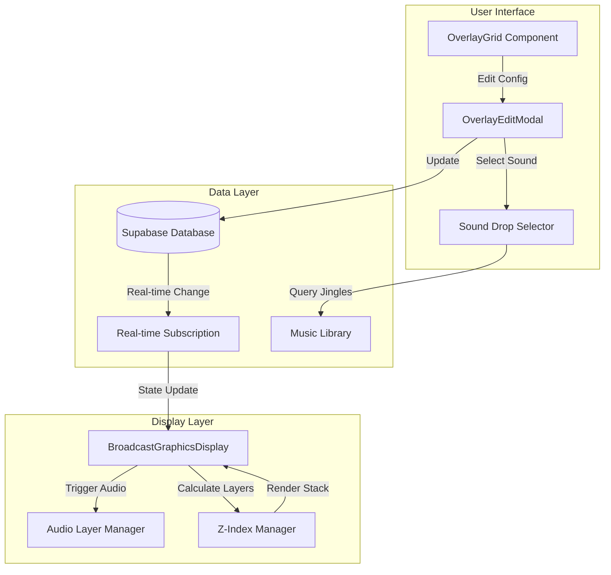
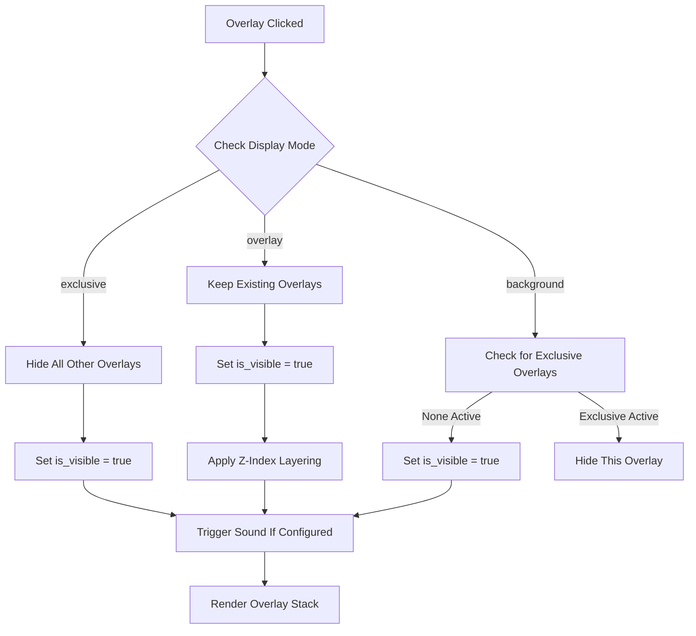
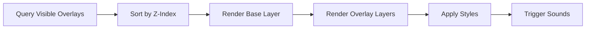
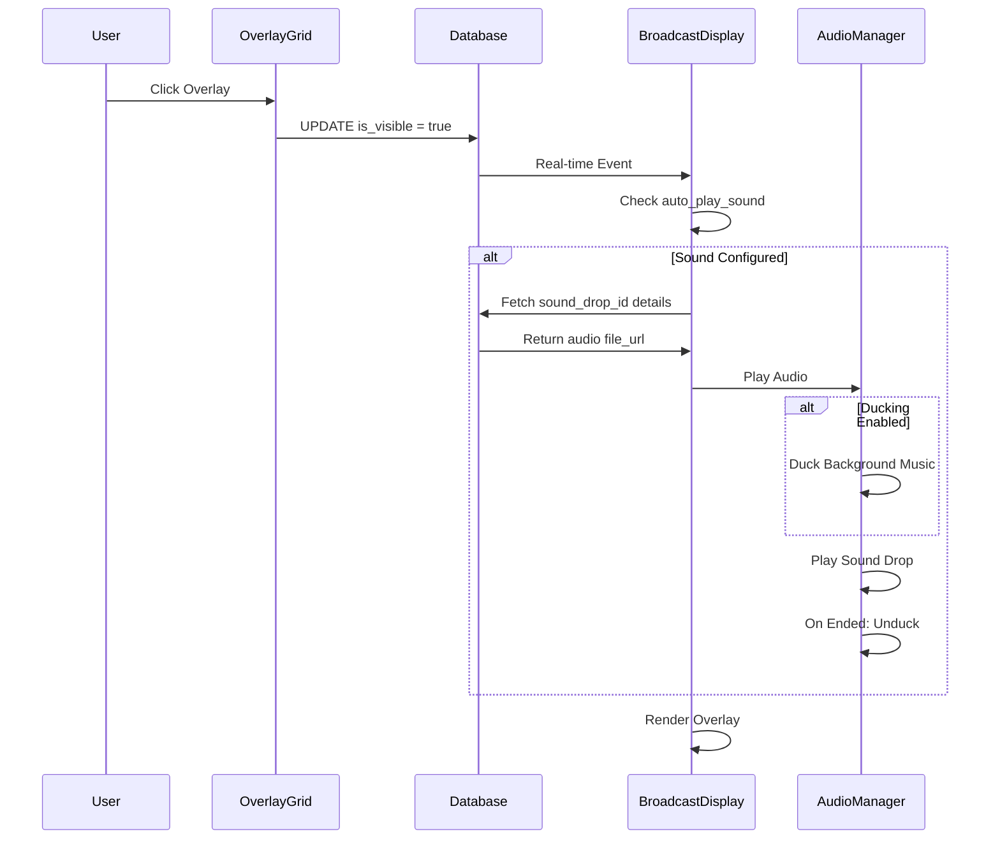
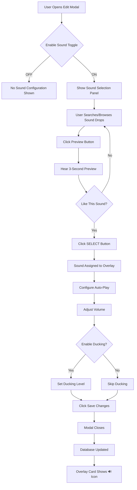
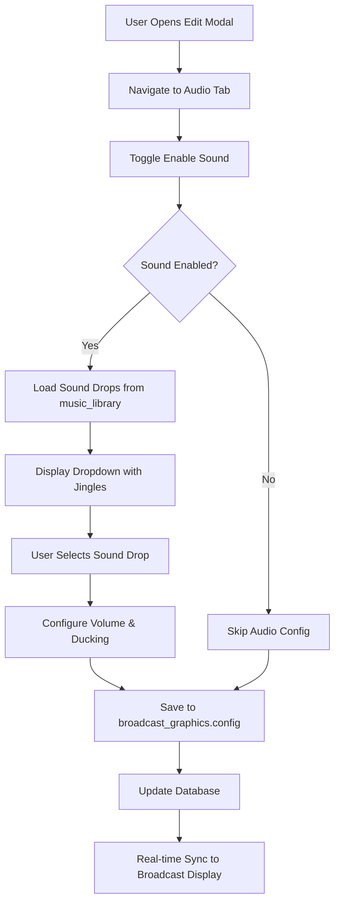
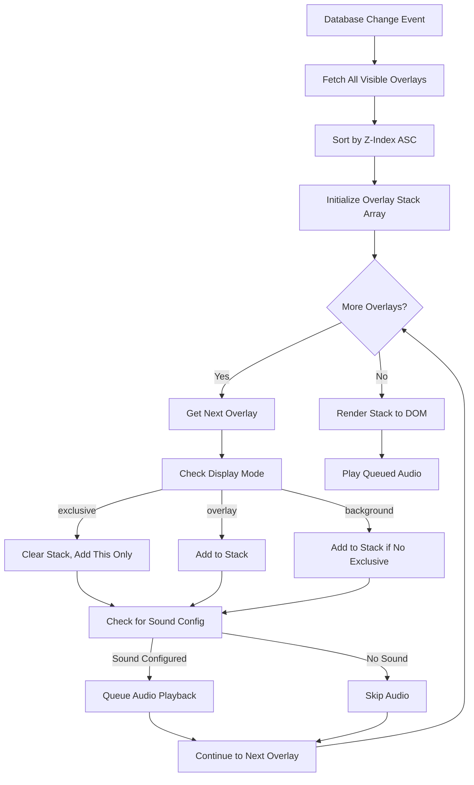
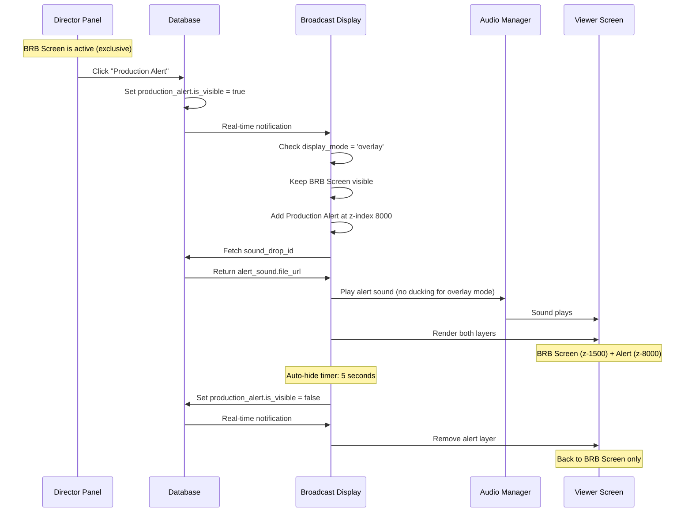

# Overlay Sound Integration Design

## Overview

Enhancement to the broadcast graphics overlay system enabling:
1. **Sound Drop Assignment**: Associate audio files from the Studio's sound drops library with graphic overlays
2. **Multi-Layer Display**: Support simultaneous display of multiple overlays with z-index layering strategy
3. **Transparent Overlay Support**: Enable overlays like "Production Alert" to display atop other active overlays

## Problem Statement

### Current Limitations

**Single Overlay Constraint**
- System enforces exclusive visibility (only one overlay active at a time)
- Clicking an overlay hides all others via database update
- Production alerts and notifications cannot appear over main overlays

**No Audio Integration**
- Overlays lack audio capabilities
- Sound drops exist separately in Studio Control Panel
- No mechanism to trigger sounds when overlays appear

### User Requirements

**Sound Assignment**
- Selectively assign sound drops to specific overlays
- Not all overlays require sound (e.g., silent transitions)
- Sound should play automatically when overlay becomes visible

**Layered Display**
- Transparent overlays (Production Alert) must display over other content
- Full-screen overlays need quick return to normal screen
- Multiple overlays visible simultaneously with proper z-index management

## Technology Stack

**Frontend**
- React components: OverlayGrid, BroadcastGraphicsDisplay
- Supabase real-time subscriptions for state synchronization
- Web Audio API for sound playback

**Backend**
- Supabase PostgreSQL database
- Table: `broadcast_graphics`
- Table: `music_library` (jingle category for sound drops)

**Audio System**
- Existing sound drops in Studio Control Panel
- Categories: intro, outro, stinger, custom
- Audio ducking system available

## Architecture

### Data Model Extension

**Enhanced broadcast_graphics Table Structure**

| Column | Type | Purpose |
|--------|------|---------|
| id | uuid | Unique identifier |
| graphic_type | text | Type identifier (existing) |
| is_visible | boolean | Visibility state (existing) |
| html_file | text | HTML file path (existing) |
| position | text | Positioning mode (existing) |
| config | jsonb | Configuration object (existing) |
| **display_mode** | text | New: 'exclusive', 'overlay', 'background' |
| **z_index** | integer | New: Layer order (100-9999) |
| **sound_drop_id** | uuid | New: FK to music_library |
| **auto_play_sound** | boolean | New: Play sound on visibility |
| created_at | timestamp | Creation timestamp (existing) |
| updated_at | timestamp | Last update (existing) |

**Display Mode Definitions**

| Mode | Behavior | Z-Index Range | Use Case |
|------|----------|---------------|----------|
| exclusive | Hides all other overlays | 1000-1999 | Full-screen scenes (BRB, Starting Soon) |
| overlay | Displays over existing content | 5000-8999 | Production alerts, notifications |
| background | Base layer, can be overlaid | 100-999 | Episode info, lower thirds |

**Sound Drop Association Schema**

Foreign key relationship:
```
broadcast_graphics.sound_drop_id → music_library.id
WHERE music_library.category = 'jingle'
```

### Component Architecture



### Visibility Management Strategy

**Multi-Layer Rendering Logic**



**Z-Index Assignment Rules**

| Overlay Type | Display Mode | Default Z-Index | Sound Required |
|--------------|--------------|-----------------|----------------|
| Production Alert | overlay | 8000 | Optional (notification sound) |
| Starting Soon | exclusive | 1500 | Optional (intro music) |
| BRB Screen | exclusive | 1500 | Optional (intermission jingle) |
| Episode Info | background | 500 | No |
| Lower Thirds | overlay | 6000 | No |
| Finish Him | overlay | 7000 | Yes (impact sound) |
| Tomato Game | exclusive | 1800 | Yes (game intro) |

## Feature Design

### Sound Drop Assignment

**OverlayEditModal Enhancement**

Component will include new section for sound configuration:

**Sound Configuration Panel**

| Field | Type | Options | Description |
|-------|------|---------|-------------|
| Enable Sound | Toggle | On/Off | Master switch for audio |
| Sound Drop | Dropdown | List from music_library (category='jingle') | Select audio file |
| Auto-Play | Toggle | On/Off | Play when overlay appears |
| Volume | Slider | 0-100% | Playback volume |
| Ducking | Toggle | On/Off | Enable audio ducking for background music |

**Sound Drop Selector Component**

Displays available sound drops grouped by type:
- INTRO (show intros, theme music)
- OUTRO (closing themes, credits music)
- STINGERS (short impacts, transitions)
- CUSTOM (special effects, notifications)

Search and filter capabilities:
- Text search by title
- Filter by jingle_type
- Preview playback button

### Multi-Layer Display System

**BroadcastGraphicsDisplay Component Revision**

**Current Behavior**
- Renders single overlay when is_visible = true
- Real-time subscription updates on changes
- Fullscreen iframe rendering

**Enhanced Behavior**
- Query all visible overlays: `SELECT * FROM broadcast_graphics WHERE is_visible = true ORDER BY z_index ASC`
- Render multiple overlays as stacked layers
- Apply z-index from database to style
- Maintain real-time synchronization

**Rendering Strategy**



**Overlay Stack Rendering**

Each overlay rendered as positioned div:
- Position: fixed (all overlays)
- Top/Left: 0 (fullscreen coverage)
- Width/Height: 100vw/100vh
- Z-Index: from database
- Pointer Events: configurable (transparent overlays may pass through)

**Example Rendered Stack**

| Layer | Overlay | Z-Index | Pointer Events |
|-------|---------|---------|----------------|
| Base | Episode Info | 500 | none (clickthrough) |
| Mid | BRB Screen | 1500 | auto (clickable) |
| Top | Production Alert | 8000 | none (transparent) |

### Audio Playback Integration

**Audio Layer Manager**

Responsible for:
1. Monitoring visibility changes via Supabase real-time
2. Triggering sound playback when overlay appears
3. Managing audio ducking with background music
4. Handling audio cleanup on overlay hide

**Playback Flow**



**Audio Configuration Object**

Stored in config.audio:
```
{
  enabled: boolean
  sound_drop_id: string | null
  auto_play: boolean
  volume: number (0.0-1.0)
  enable_ducking: boolean
  ducking_level: number (0.0-1.0)
}
```

### Quick Return Mechanism

**"Back to Normal" Functionality**

**Implementation Options**

| Approach | Mechanism | User Action | Technical Implementation |
|----------|-----------|-------------|-------------------------|
| Keyboard Shortcut | Global key listener | Press ESC | Event listener in BroadcastDisplay |
| Click-to-Close | Click overlay area | Click anywhere | onClick handler hides exclusive overlays |
| Auto-Hide Timer | Timed visibility | Wait N seconds | setTimeout with configurable duration |
| Hide All Button | UI control | Click button | Supabase update all is_visible = false |

**Recommended: Hybrid Approach**

Combination of methods based on display_mode:

| Display Mode | Primary Method | Secondary Method |
|--------------|----------------|------------------|
| exclusive | Click-to-Close hint | ESC key |
| overlay | Auto-hide timer (optional) | Manual hide button |
| background | Always visible | Manual hide only |

**Click-to-Close Implementation**

Visual indicator displayed with exclusive overlays:
- Position: bottom-right corner
- Text: "Click anywhere to return" or "Press ESC"
- Style: semi-transparent badge
- Animation: fade-in with pulse

## User Interface Design

### Manual Sound Assignment Workflow

**How Users Add Sounds to Overlays**

Users configure sounds through the existing edit modal interface - **no code required**.

**Step-by-Step Process**:

1. **Open Graphics Overlay Panel**
   - Navigate to Director Panel → Graphics section
   - View grid of all available overlays

2. **Edit Overlay (Ctrl+Click)**
   - Hold Ctrl (Cmd on Mac) and click desired overlay card
   - Edit modal opens with overlay configuration

3. **Configure Audio Settings**
   - Navigate to "Audio Configuration" section within modal
   - Toggle "Enable Sound" switch to ON
   - Sound Drop selector appears

4. **Select Sound Drop**
   - Click "Select Sound Drop" dropdown
   - Browse available sound drops from Studio library
   - Organized by category: INTRO, OUTRO, STINGER, CUSTOM
   - Use search box to filter by name
   - Click preview button (▶) to hear sound before selecting
   - Click sound to select

5. **Fine-Tune Audio Settings**
   - Toggle "Auto-Play on Visibility" (recommended: ON)
   - Adjust volume slider (0-100%)
   - Enable audio ducking if overlay should reduce background music
   - Set ducking level if enabled (recommended: 30%)

6. **Save Configuration**
   - Click "Save Changes" button
   - Modal closes, sound configuration stored in database
   - Overlay card now displays 🔊 icon indicating sound is configured

7. **Test Configuration**
   - Click overlay to broadcast it
   - Sound should play automatically (if auto-play enabled)
   - Verify volume and ducking behavior

**Key Points**:
- ✅ **100% UI-driven** - no code editing required
- ✅ **Visual feedback** - 🔊 icon shows sound is configured
- ✅ **Live preview** - test sounds before saving
- ✅ **Per-overlay configuration** - each overlay can have different sound
- ✅ **Optional feature** - overlays without sounds work normally

### OverlayGrid Enhancements

**Visual Indicators**

| Element | Current | Enhanced |
|---------|---------|----------|
| Visibility Badge | "● VISIBLE" (green) | "● LIVE" + layer icon |
| Display Mode | Not shown | Badge: "FULL" / "OVER" / "BASE" |
| Sound Indicator | Not shown | 🔊 icon if sound configured |
| Layer Order | Not shown | Small z-index number |

**Card Layout Revision**

Each overlay card displays:
- Icon (existing)
- Name (existing)
- Graphic type (existing)
- **New**: Display mode badge
- **New**: Sound indicator icon (🔊 if sound_drop_id exists)
- **New**: Layer order number
- Visibility badge (enhanced)

### OverlayEditModal New Sections

**Audio Configuration Section**

New section within the existing edit modal (appears below content fields).

**Header**: "🔊 Sound Configuration"

**Layout Structure**:

```
┌─────────────────────────────────────────────────┐
│ 🔊 Sound Configuration                          │
├─────────────────────────────────────────────────┤
│                                                 │
│ [ ] Enable Sound for this Overlay               │
│                                                 │
│ ┌─────────────────────────────────────────┐    │
│ │ Sound Drop Selection                     │    │
│ │                                          │    │
│ │ Search: [____________] 🔍                │    │
│ │                                          │    │
│ │ ▼ INTRO                                  │    │
│ │   • Show Intro Theme        ▶ SELECT     │    │
│ │   • Episode Start Fanfare   ▶ SELECT     │    │
│ │                                          │    │
│ │ ▼ STINGERS                               │    │
│ │   • Quick Impact            ▶ SELECT     │    │
│ │   • Notification Bell       ▶ SELECT     │    │
│ │                                          │    │
│ │ ▼ CUSTOM                                 │    │
│ │   • Alert Sound             ▶ SELECT     │    │
│ └─────────────────────────────────────────┘    │
│                                                 │
│ Selected: Alert Sound                    [REMOVE]│
│                                                 │
│ [✓] Auto-Play when overlay appears              │
│                                                 │
│ Volume: [========>    ] 80%                     │
│                                                 │
│ [✓] Enable Audio Ducking                        │
│ Ducking Level: [====>      ] 30%                │
│                                                 │
└─────────────────────────────────────────────────┘
```

**Interactive Elements**:

1. **Enable Sound Toggle**
   - Default: OFF (no sound)
   - When ON: reveals all audio configuration options
   - When OFF: hides sound configuration, clears sound_drop_id

2. **Sound Drop Selection Panel**
   - Only visible when "Enable Sound" is ON
   - Search input filters sound drops by title
   - Categorized accordion sections (collapsible)
   - Each sound shows:
     - Title
     - Duration (if available)
     - Preview button (▶) - plays 3-second preview
     - SELECT button - assigns to overlay
   - Selected sound highlighted in blue

3. **Selected Sound Display**
   - Shows currently selected sound drop name
   - REMOVE button to unselect
   - Displays duration and category

4. **Auto-Play Toggle**
   - Default: ON (recommended)
   - Label: "Auto-Play when overlay appears"
   - Tooltip: "Sound will play automatically when overlay becomes visible"

5. **Volume Slider**
   - Range: 0-100%
   - Default: 80%
   - Real-time preview available
   - Percentage indicator updates as user drags

6. **Audio Ducking Section**
   - Enable Ducking Toggle (default: OFF)
   - When enabled, reveals Ducking Level slider
   - Ducking Level: 0-100% (default: 30%)
   - Tooltip: "Reduces background music volume when this sound plays"

**User Interaction Flow**:



**Display Settings Tab**

New tab in edit modal:

**Header**: "🎨 Display Settings"

**Fields**:
1. Display Mode Radio Group
   - Exclusive (Full-screen, hides others)
   - Overlay (Transparent layer)
   - Background (Base layer)
2. Z-Index Input (auto-filled based on mode, manual override)
3. Click Behavior Dropdown
   - Close on click
   - Pass-through clicks
   - No action
4. Auto-Hide Settings
   - Enable auto-hide toggle
   - Duration input (seconds)

### BroadcastGraphicsDisplay UI

**Overlay Stack Display**

No changes to visual appearance from user perspective, but internal rendering supports multiple layers.

**Debug Mode** (development only)

Overlay displaying current stack:
- List of active overlays
- Z-index values
- Display modes
- Audio status

## Data Flow Diagrams

### Sound Drop Assignment Flow



### Multi-Overlay Rendering Flow



### User Interaction Flow - Production Alert Example



## Database Schema Changes

### Migration: Add Sound and Layer Columns

**Table**: broadcast_graphics

**New Columns**:

| Column Name | Data Type | Nullable | Default | Constraint |
|-------------|-----------|----------|---------|------------|
| display_mode | text | No | 'exclusive' | CHECK (display_mode IN ('exclusive', 'overlay', 'background')) |
| z_index | integer | No | 1000 | CHECK (z_index >= 100 AND z_index <= 9999) |
| sound_drop_id | uuid | Yes | NULL | FOREIGN KEY (sound_drop_id) REFERENCES music_library(id) ON DELETE SET NULL |
| auto_play_sound | boolean | No | false | - |

**Indexes**:
- CREATE INDEX idx_broadcast_graphics_visible_zindex ON broadcast_graphics(is_visible, z_index) WHERE is_visible = true;
- CREATE INDEX idx_broadcast_graphics_sound ON broadcast_graphics(sound_drop_id) WHERE sound_drop_id IS NOT NULL;

### Default Z-Index Assignment

Automatic z-index assignment based on graphic_type:

| Graphic Type | Display Mode | Z-Index |
|--------------|--------------|---------|
| starting_soon | exclusive | 1500 |
| brb | exclusive | 1500 |
| outro | exclusive | 1500 |
| tech_difficulties | exclusive | 1500 |
| tomato_chat_game | exclusive | 1800 |
| production_alert | overlay | 8000 |
| finish_him | overlay | 7000 |
| new_member | overlay | 6500 |
| rage_meter | overlay | 6500 |
| milestone | overlay | 6500 |
| chat_highlight | overlay | 6500 |
| pi_namecard_overlay | background | 500 |
| episode_info | background | 500 |
| logo | background | 300 |

## API Specification

### OverlayGrid Component API

**New Method: handleOverlayClick**

Input Parameters:
- overlay: Overlay object
- event: React.MouseEvent

Logic Changes:
- Remove "hide all others" step for overlay and background modes
- Keep "hide all others" for exclusive mode only
- Maintain Ctrl+Click edit behavior

### BroadcastGraphicsDisplay Component API

**Enhanced State Management**

State Variables:
- activeGraphics: BroadcastGraphic[] (existing, now sorted array)
- audioQueue: AudioPlaybackTask[] (new)
- layerStack: OverlayLayer[] (new)

**New Method: playOverlaySound**

Input Parameters:
- graphic: BroadcastGraphic
- soundDropId: string

Responsibilities:
1. Fetch audio file URL from music_library
2. Create Audio element
3. Apply volume and ducking settings
4. Play audio
5. Clean up on ended

**New Method: calculateLayerStack**

Input Parameters:
- graphics: BroadcastGraphic[]

Returns: OverlayLayer[]

Algorithm:
1. Filter graphics where is_visible = true
2. Sort by z_index ascending
3. Check for exclusive mode overlays
4. If exclusive found, return only exclusive overlay
5. Otherwise, return all sorted overlays

### OverlayEditModal Component API

**New Props**:
- availableSoundDrops: MusicTrack[] (fetched jingles)
- onSoundDropSelect: (dropId: string) => void

**New State**:
- audioConfig: AudioConfig object
- selectedSoundDrop: MusicTrack | null

**New Methods**:
- loadAvailableSoundDrops(): Fetch jingles from music_library
- updateAudioConfig(field, value): Update audio settings
- previewSoundDrop(dropId): Play preview of selected sound

## Testing Strategy

### Unit Testing Scenarios

**OverlayGrid Component**

| Test Case | Input | Expected Output |
|-----------|-------|-----------------|
| Click exclusive overlay | Overlay with display_mode='exclusive' | All other overlays hidden |
| Click overlay mode | Overlay with display_mode='overlay' | Existing overlays remain visible |
| Click background mode | Overlay with display_mode='background' when exclusive active | Overlay remains hidden |
| Sound configured | Overlay with sound_drop_id set | Audio playback triggered |

**BroadcastGraphicsDisplay Component**

| Test Case | Input | Expected Output |
|-----------|-------|-----------------|
| Multiple visible overlays | 3 overlays with z-index 500, 1500, 8000 | Rendered in correct order |
| Exclusive overlay present | 1 exclusive + 2 overlay mode | Only exclusive rendered |
| Sound auto-play enabled | Overlay with auto_play_sound=true | playOverlaySound called |
| Real-time visibility change | Database update is_visible=true | Component re-renders stack |

### Integration Testing Scenarios

**Sound Playback Integration**

Test Sequence:
1. Configure overlay with sound drop
2. Enable auto-play
3. Trigger overlay visibility
4. Verify audio plays through Web Audio API
5. Verify ducking applied if enabled
6. Verify audio cleanup on overlay hide

**Multi-Layer Display**

Test Sequence:
1. Activate background overlay (Episode Info, z-500)
2. Activate exclusive overlay (BRB Screen, z-1500)
3. Verify only BRB Screen visible
4. Hide BRB Screen
5. Verify Episode Info reappears
6. Activate overlay mode (Production Alert, z-8000)
7. Verify both Episode Info and Production Alert visible

**Quick Return**

Test Sequence:
1. Display exclusive overlay
2. Click anywhere on overlay
3. Verify overlay hidden
4. Press ESC key
5. Verify all overlays hidden (if applicable)

## Edge Cases & Error Handling

### Sound Playback Failures

| Scenario | Handling Strategy |
|----------|------------------|
| Sound file URL invalid | Log error, display overlay without sound |
| Sound file fails to load | Retry once, then skip audio |
| Audio context suspended (browser policy) | Display "Click to enable audio" prompt |
| Sound drop deleted from library | Display warning, set sound_drop_id to NULL |

### Layer Conflicts

| Scenario | Resolution |
|----------|-----------|
| Two exclusive overlays visible | Display highest z-index only |
| Z-index collision (same value) | Use created_at timestamp as tiebreaker |
| Invalid z-index value | Fallback to default based on display_mode |
| Circular dependency in layering | Sort by ID as fallback |

### Database Sync Issues

| Scenario | Handling Strategy |
|----------|------------------|
| Real-time subscription dropped | Implement reconnection logic with exponential backoff |
| Conflicting updates (race condition) | Use optimistic locking with updated_at timestamp |
| Database query timeout | Display cached state, retry query |

## Performance Considerations

### Rendering Optimization

**Strategy**: Minimize re-renders using React memoization

Components:
- Memoize overlay render function
- Use React.memo for overlay card components
- Implement virtual DOM diffing for stack changes

**Metrics**:
- Target: <16ms render time (60fps)
- Maximum overlay count: 10 simultaneous overlays
- Audio playback latency: <100ms

### Audio Performance

**Web Audio API Best Practices**:
- Reuse AudioContext instance (singleton)
- Preload sound drops for instant playback
- Implement audio pooling for frequently used sounds
- Use GainNode for volume control (no DOM manipulation)

**Memory Management**:
- Clean up Audio elements on overlay hide
- Limit concurrent audio playback to 3 sounds
- Implement audio queue for overlapping sounds

### Database Query Optimization

**Efficient Queries**:
- Use indexed query: `WHERE is_visible = true ORDER BY z_index`
- Implement query result caching (1-second TTL)
- Use Supabase real-time filters to reduce payload size

**Example Optimized Query**:
```
SELECT id, graphic_type, display_mode, z_index, html_file, 
       config->>'audio' as audio_config, sound_drop_id
FROM broadcast_graphics 
WHERE is_visible = true 
ORDER BY z_index ASC
```

## Security Considerations

### Audio File Access

**Validation Requirements**:
- Verify sound_drop_id exists in music_library before playback
- Ensure user has permission to access sound drop
- Validate audio file URL origin (same-origin or CORS-enabled)

### Z-Index Injection Prevention

**Constraints**:
- Database-level CHECK constraint on z_index range
- Frontend validation before database update
- Sanitize user input for z_index override

### XSS Prevention in Overlays

**Security Measures**:
- Iframe sandboxing for HTML overlay files
- Content Security Policy headers
- Validate and sanitize config JSON fields

## Rollout Strategy

### Phase 1: Database Migration

**Deliverables**:
- Migration SQL script
- Default value population script
- Data validation queries

**Testing**:
- Verify migration on staging database
- Confirm no data loss
- Test foreign key constraints

### Phase 2: Backend Component Updates

**Deliverables**:
- Enhanced BroadcastGraphicsDisplay component
- Audio Layer Manager utility
- Z-Index calculation logic

**Testing**:
- Unit tests for layer calculation
- Integration tests for audio playback
- Real-time subscription validation

### Phase 3: UI Enhancements

**Deliverables**:
- Updated OverlayGrid with indicators
- Sound configuration in OverlayEditModal
- Display settings panel

**Testing**:
- Component rendering tests
- User interaction tests
- Visual regression tests

### Phase 4: Production Deployment

**Deployment Checklist**:
- [ ] Database migration executed
- [ ] Component updates deployed
- [ ] Real-time subscriptions verified
- [ ] Audio playback tested on production
- [ ] User documentation updated
- [ ] Performance monitoring enabled

## Complete User Workflow Example

### Example: Adding Alert Sound to Production Alert Overlay

**Scenario**: User wants Production Alert overlay to play a notification sound when it appears during live stream.

**Workflow**:

1. **Navigate to Graphics Panel**
   - Open Director Panel in browser (http://localhost:5173)
   - Scroll to "Graphics Overlays" section
   - Locate "Production Alert" overlay card

2. **Open Configuration**
   - Hold Ctrl (or Cmd on Mac)
   - Click "Production Alert" card
   - Edit modal appears

3. **Enable Sound**
   - Scroll to "🔊 Sound Configuration" section
   - Click "Enable Sound for this Overlay" toggle
   - Sound selection panel expands

4. **Select Sound Drop**
   - Type "alert" in search box
   - System filters to show matching sounds
   - See "Notification Bell" in STINGERS category
   - Click preview button (▶) next to "Notification Bell"
   - Hear 3-second preview through browser
   - Sound is appropriate, click "SELECT" button

5. **Configure Playback**
   - Selected sound displays: "Notification Bell (2.5s)"
   - "Auto-Play when overlay appears" already checked ✓
   - Volume slider set to 80% (good default)
   - Enable Audio Ducking toggle: turn ON
   - Set Ducking Level to 30% (reduces background music)

6. **Save Configuration**
   - Click "Save Changes" button at bottom of modal
   - Modal closes with success message
   - Return to overlay grid

7. **Visual Confirmation**
   - "Production Alert" card now shows:
     - 🔊 icon in top-right corner
     - "OVER" badge (overlay display mode)
     - z-index: 8000

8. **Test in Action**
   - Click "Production Alert" overlay card (normal click)
   - Overlay appears on broadcast view
   - "Notification Bell" sound plays automatically
   - Background music volume reduces to 70% (ducking active)
   - After 2.5 seconds, background music returns to 100%
   - Production alert remains visible (overlay mode)

9. **Modify Later** (Optional)
   - Ctrl+Click "Production Alert" again
   - Change sound to different drop
   - Or disable sound entirely by toggling OFF
   - Or adjust volume/ducking settings

**Result**: Production Alert overlay now has professional notification sound that plays automatically, with smooth background music ducking - all configured through UI in under 2 minutes.

## Administrative Configuration

### Setting Display Modes and Z-Index

**Two Configuration Methods**:

#### Method 1: UI Configuration (Recommended)

Added "Display Settings" section to OverlayEditModal:

**Access**: Ctrl+Click overlay → Display Settings section

**Configurable Fields**:

1. **Display Mode** (Radio buttons)
   - ( ) Exclusive - Full-screen, hides all other overlays
   - ( ) Overlay - Transparent layer over existing content
   - ( ) Background - Base layer, can be overlaid

2. **Layer Order (Z-Index)**
   - Auto-assigned based on display mode
   - Manual override input field for advanced users
   - Visual indicator showing layer position

3. **Click Behavior**
   - Dropdown: Close on click / Pass-through / No action

4. **Auto-Hide** (Optional)
   - Toggle: Enable auto-hide
   - Input: Duration in seconds

**Default Values**:
- New overlays: display_mode='exclusive', z_index=1500
- Can be changed by user through modal
- Validated before saving to database

#### Method 2: Database Direct Edit (Advanced)

**For bulk updates or initial setup**:

1. Open Supabase Dashboard
2. Navigate to Table Editor → broadcast_graphics
3. Edit row for specific overlay
4. Set columns:
   - display_mode: 'exclusive' | 'overlay' | 'background'
   - z_index: 100-9999 (integer)
   - auto_play_sound: true | false
5. Save changes
6. Changes sync to UI automatically via real-time subscription

**Recommended Z-Index Ranges**:
- Background overlays: 100-999
- Exclusive overlays: 1000-1999
- Overlay mode: 5000-8999
- Critical alerts: 9000-9999

## Complete SQL Migration Script

### Migration File: `add_overlay_sound_and_layering.sql`

**Purpose**: Add sound drop integration and multi-layer display capabilities to broadcast_graphics table

**Instructions for Minimax**:
1. Copy the entire SQL script below
2. Execute in Supabase SQL Editor
3. Verify migration success by checking new columns exist
4. Test with sample data inserts

```sql
-- =====================================================
-- OVERLAY SOUND INTEGRATION & LAYERING MIGRATION
-- =====================================================
-- Date: 2025-01-21
-- Purpose: Add sound drop support and multi-layer display to broadcast_graphics
-- Tables Modified: broadcast_graphics
-- New Indexes: 3
-- Backward Compatible: Yes (all new columns nullable or have defaults)

-- =====================================================
-- STEP 1: Add New Columns to broadcast_graphics
-- =====================================================

ALTER TABLE broadcast_graphics
  ADD COLUMN IF NOT EXISTS display_mode TEXT DEFAULT 'exclusive'
    CHECK (display_mode IN ('exclusive', 'overlay', 'background')),
  ADD COLUMN IF NOT EXISTS z_index INTEGER DEFAULT 1000
    CHECK (z_index >= 100 AND z_index <= 9999),
  ADD COLUMN IF NOT EXISTS sound_drop_id UUID
    REFERENCES music_library(id) ON DELETE SET NULL,
  ADD COLUMN IF NOT EXISTS auto_play_sound BOOLEAN DEFAULT false;

-- =====================================================
-- STEP 2: Add Column Comments (Documentation)
-- =====================================================

COMMENT ON COLUMN broadcast_graphics.display_mode IS 
  'Display behavior: exclusive (hides others), overlay (transparent layer), background (base layer)';

COMMENT ON COLUMN broadcast_graphics.z_index IS 
  'Layer order for rendering (100-9999). Higher values appear on top.';

COMMENT ON COLUMN broadcast_graphics.sound_drop_id IS 
  'Foreign key to music_library. Sound to play when overlay appears.';

COMMENT ON COLUMN broadcast_graphics.auto_play_sound IS 
  'If true, play sound_drop_id automatically when is_visible becomes true.';

-- =====================================================
-- STEP 3: Create Indexes for Performance
-- =====================================================

-- Index for querying visible overlays sorted by z_index (most common query)
CREATE INDEX IF NOT EXISTS idx_broadcast_graphics_visible_zindex 
  ON broadcast_graphics(is_visible, z_index) 
  WHERE is_visible = true;

-- Index for finding overlays with sound drops
CREATE INDEX IF NOT EXISTS idx_broadcast_graphics_sound 
  ON broadcast_graphics(sound_drop_id) 
  WHERE sound_drop_id IS NOT NULL;

-- Index for filtering by display mode
CREATE INDEX IF NOT EXISTS idx_broadcast_graphics_display_mode 
  ON broadcast_graphics(display_mode, z_index);

-- =====================================================
-- STEP 4: Set Default Values for Existing Rows
-- =====================================================

-- Assign default z_index based on graphic_type and typical usage patterns
-- Background overlays (100-999)
UPDATE broadcast_graphics
SET z_index = 300
WHERE graphic_type IN ('logo')
AND z_index = 1000; -- Only update if still at default

UPDATE broadcast_graphics
SET z_index = 500
WHERE graphic_type IN ('pi_namecard_overlay', 'episode_info')
AND z_index = 1000;

-- Exclusive overlays (1000-1999)
UPDATE broadcast_graphics
SET z_index = 1500, display_mode = 'exclusive'
WHERE graphic_type IN ('starting_soon', 'brb', 'outro', 'tech_difficulties')
AND z_index = 1000;

UPDATE broadcast_graphics
SET z_index = 1800, display_mode = 'exclusive'
WHERE graphic_type IN ('tomato_chat_game', 'brb_tomato_game')
AND z_index = 1000;

-- Overlay mode (5000-8999)
UPDATE broadcast_graphics
SET z_index = 6500, display_mode = 'overlay'
WHERE graphic_type IN ('new_member', 'rage_meter', 'milestone', 'chat_highlight', 'versus')
AND z_index = 1000;

UPDATE broadcast_graphics
SET z_index = 7000, display_mode = 'overlay'
WHERE graphic_type IN ('finish_him')
AND z_index = 1000;

UPDATE broadcast_graphics
SET z_index = 8000, display_mode = 'overlay'
WHERE graphic_type LIKE '%production_alert%' OR graphic_type LIKE '%alert%'
AND z_index = 1000;

-- Background mode for info overlays
UPDATE broadcast_graphics
SET display_mode = 'background'
WHERE graphic_type IN ('logo', 'pi_namecard_overlay', 'episode_info')
AND display_mode = 'exclusive';

-- =====================================================
-- STEP 5: Create Helper Function (Optional but Recommended)
-- =====================================================

-- Function to get next available z_index in a range
CREATE OR REPLACE FUNCTION get_next_z_index(mode TEXT)
RETURNS INTEGER
LANGUAGE plpgsql
AS $$
DECLARE
  min_z INTEGER;
  max_z INTEGER;
  next_z INTEGER;
BEGIN
  -- Determine range based on display mode
  CASE mode
    WHEN 'background' THEN
      min_z := 100;
      max_z := 999;
    WHEN 'exclusive' THEN
      min_z := 1000;
      max_z := 1999;
    WHEN 'overlay' THEN
      min_z := 5000;
      max_z := 8999;
    ELSE
      min_z := 1000;
      max_z := 1999;
  END CASE;
  
  -- Find next available z_index in range
  SELECT COALESCE(MAX(z_index) + 10, min_z)
  INTO next_z
  FROM broadcast_graphics
  WHERE z_index >= min_z AND z_index <= max_z;
  
  -- Ensure we don't exceed max
  IF next_z > max_z THEN
    next_z := min_z;
  END IF;
  
  RETURN next_z;
END;
$$;

COMMENT ON FUNCTION get_next_z_index(TEXT) IS 
  'Returns next available z_index for given display_mode. Useful for auto-assigning layer order.';

-- =====================================================
-- STEP 6: Create View for Easy Querying (Optional)
-- =====================================================

CREATE OR REPLACE VIEW broadcast_graphics_with_sound AS
SELECT 
  bg.id,
  bg.graphic_type,
  bg.is_visible,
  bg.html_file,
  bg.position,
  bg.config,
  bg.display_mode,
  bg.z_index,
  bg.auto_play_sound,
  bg.sound_drop_id,
  ml.title AS sound_drop_title,
  ml.duration AS sound_drop_duration,
  ml.file_url AS sound_drop_url,
  ml.jingle_type AS sound_drop_type,
  bg.created_at,
  bg.updated_at
FROM broadcast_graphics bg
LEFT JOIN music_library ml ON bg.sound_drop_id = ml.id;

COMMENT ON VIEW broadcast_graphics_with_sound IS 
  'Convenient view joining broadcast_graphics with sound drop details from music_library';

-- =====================================================
-- STEP 7: Sample Data for Testing (Optional - Comment Out for Production)
-- =====================================================

-- Uncomment below to insert test sound drops if needed
/*
INSERT INTO music_library (title, file_url, file_path, category, jingle_type, duration)
VALUES 
  ('Alert Sound', 'https://example.com/alert.mp3', 'alert.mp3', 'jingle', 'custom', 2),
  ('Notification Bell', 'https://example.com/bell.mp3', 'bell.mp3', 'jingle', 'stinger', 1),
  ('Intro Theme', 'https://example.com/intro.mp3', 'intro.mp3', 'jingle', 'intro', 5)
ON CONFLICT DO NOTHING;
*/

-- =====================================================
-- STEP 8: Verification Queries
-- =====================================================

-- Run these after migration to verify success:

-- Check new columns exist
SELECT 
  column_name, 
  data_type, 
  column_default,
  is_nullable
FROM information_schema.columns
WHERE table_name = 'broadcast_graphics'
  AND column_name IN ('display_mode', 'z_index', 'sound_drop_id', 'auto_play_sound')
ORDER BY ordinal_position;

-- Check indexes were created
SELECT 
  indexname, 
  indexdef
FROM pg_indexes
WHERE tablename = 'broadcast_graphics'
  AND indexname LIKE 'idx_broadcast_graphics_%'
ORDER BY indexname;

-- View current overlay configuration
SELECT 
  graphic_type,
  display_mode,
  z_index,
  sound_drop_id IS NOT NULL AS has_sound,
  auto_play_sound,
  is_visible
FROM broadcast_graphics
ORDER BY z_index, graphic_type;

-- Count overlays by display mode
SELECT 
  display_mode,
  COUNT(*) as overlay_count,
  MIN(z_index) as min_z,
  MAX(z_index) as max_z
FROM broadcast_graphics
GROUP BY display_mode
ORDER BY min_z;

-- =====================================================
-- STEP 9: Grant Permissions (if using RLS)
-- =====================================================

-- Ensure authenticated users can read/update overlays
-- Adjust based on your RLS policies

-- Example RLS policy (adjust to your security requirements)
/*
ALTER TABLE broadcast_graphics ENABLE ROW LEVEL SECURITY;

CREATE POLICY "Allow authenticated users to read overlays"
  ON broadcast_graphics
  FOR SELECT
  TO authenticated
  USING (true);

CREATE POLICY "Allow authenticated users to update overlays"
  ON broadcast_graphics
  FOR UPDATE
  TO authenticated
  USING (true)
  WITH CHECK (true);
*/

-- =====================================================
-- MIGRATION COMPLETE
-- =====================================================

-- Summary of changes:
-- ✅ Added 4 new columns to broadcast_graphics
-- ✅ Created 3 performance indexes
-- ✅ Set default values for existing overlays
-- ✅ Created helper function for z_index management
-- ✅ Created convenience view with sound drop details
-- ✅ Added verification queries

-- Next steps:
-- 1. Run verification queries to confirm success
-- 2. Update TypeScript types (database.ts)
-- 3. Update OverlayEditModal component to show sound configuration
-- 4. Update BroadcastGraphicsDisplay for multi-layer rendering
-- 5. Test with sample overlays

SELECT 'Migration completed successfully! 🎉' AS status;
```

### Quick Verification After Running Migration

Run this query to confirm everything worked:

```sql
-- Quick health check
SELECT 
  'broadcast_graphics' AS table_name,
  COUNT(*) AS total_overlays,
  COUNT(sound_drop_id) AS overlays_with_sound,
  COUNT(DISTINCT display_mode) AS display_modes,
  MIN(z_index) AS min_z_index,
  MAX(z_index) AS max_z_index
FROM broadcast_graphics;
```

Expected result:
- total_overlays: (your current overlay count)
- overlays_with_sound: 0 (none assigned yet)
- display_modes: 3 (exclusive, overlay, background)
- min_z_index: 300
- max_z_index: 8000

### Rollback Script (In Case of Issues)

If you need to undo the migration:

```sql
-- =====================================================
-- ROLLBACK: Remove overlay sound integration
-- =====================================================
-- WARNING: This will delete all sound assignments and layer configurations

-- Drop indexes
DROP INDEX IF EXISTS idx_broadcast_graphics_visible_zindex;
DROP INDEX IF EXISTS idx_broadcast_graphics_sound;
DROP INDEX IF EXISTS idx_broadcast_graphics_display_mode;

-- Drop view
DROP VIEW IF EXISTS broadcast_graphics_with_sound;

-- Drop function
DROP FUNCTION IF EXISTS get_next_z_index(TEXT);

-- Remove columns (WARNING: Data loss)
ALTER TABLE broadcast_graphics
  DROP COLUMN IF EXISTS display_mode,
  DROP COLUMN IF EXISTS z_index,
  DROP COLUMN IF EXISTS sound_drop_id,
  DROP COLUMN IF EXISTS auto_play_sound;

SELECT 'Migration rolled back' AS status;
```

## Future Enhancements

### Advanced Audio Features

**Potential Additions**:
- Crossfade between overlays with sound
- Audio volume automation curves
- Multi-track audio mixing (overlay + background)
- Spatial audio positioning
- Sound effect library browser with waveform preview

### Enhanced Layering

**Possible Features**:
- Overlay animation transitions
- Blur/fade effects between layers
- Responsive z-index based on screen size
- Overlay grouping and presets
- Visual layer stack preview in edit modal

### User Experience

**Improvements**:
- Drag-and-drop z-index reordering in UI
- Visual preview of overlay stack (live preview)
- Keyboard shortcuts for quick overlay switching
- Overlay history and undo functionality
- Batch sound assignment to multiple overlays
- Sound drop upload directly from overlay modal
