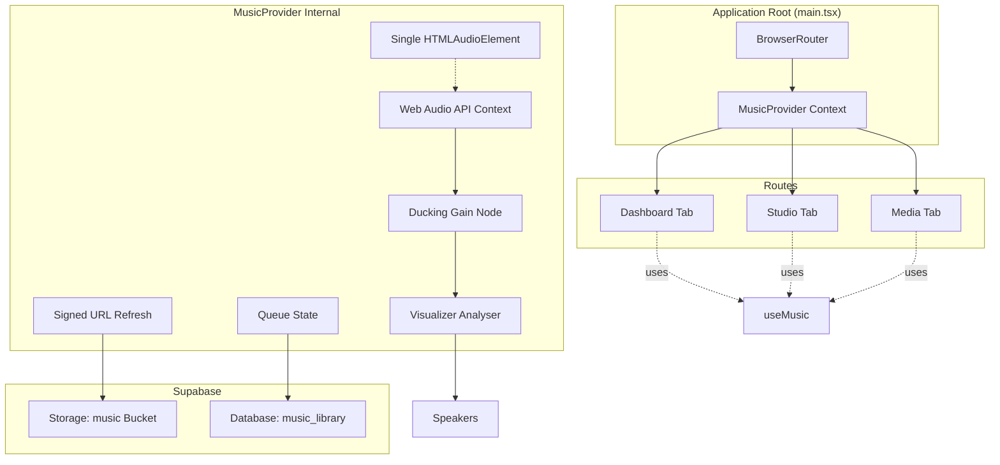
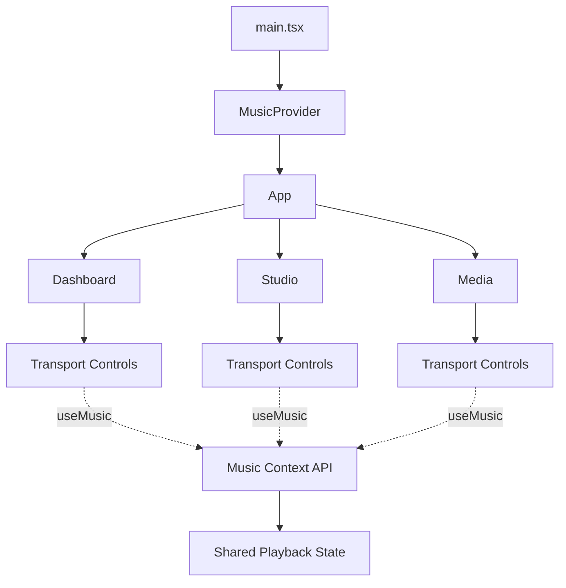
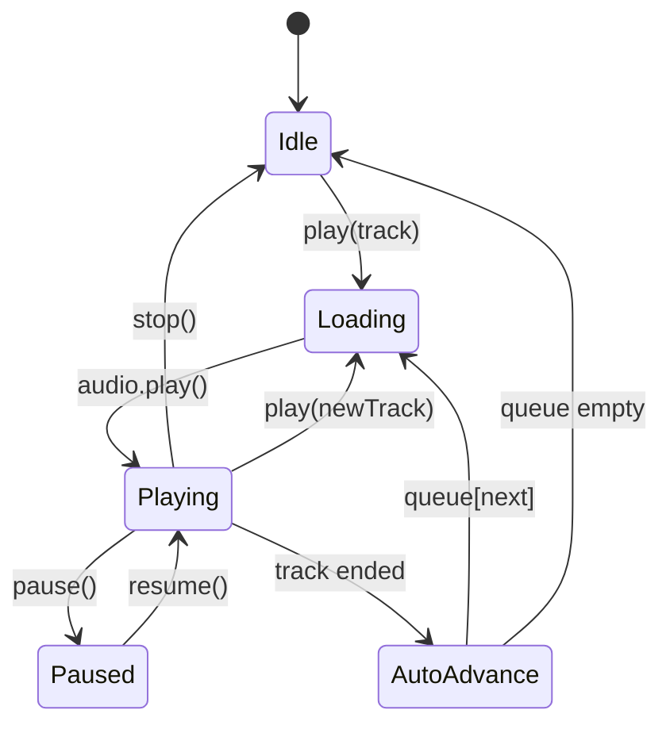
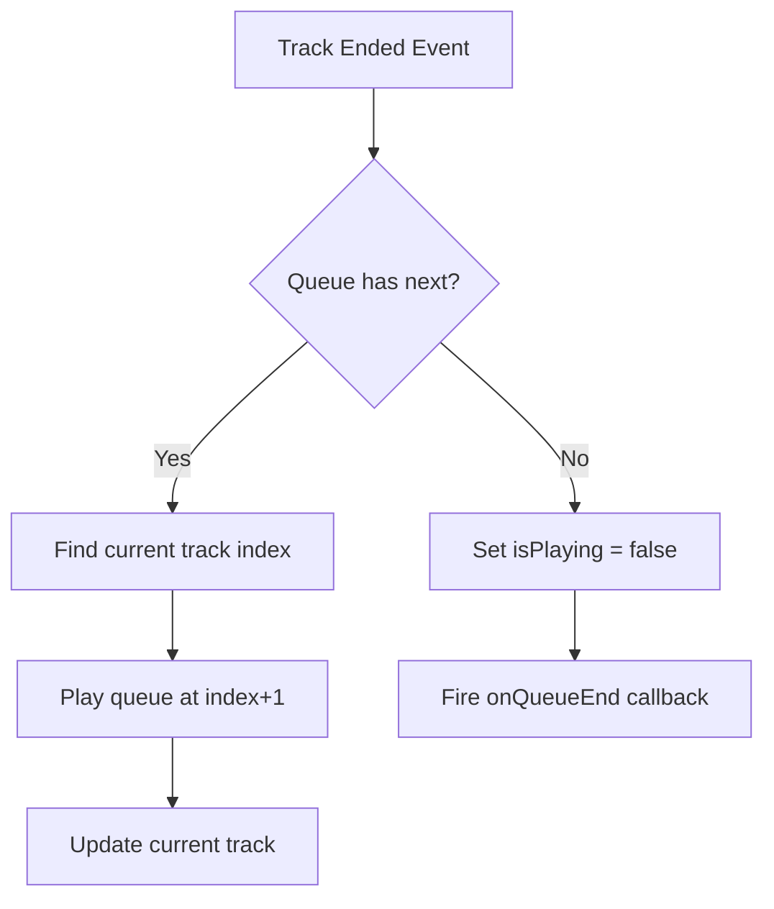
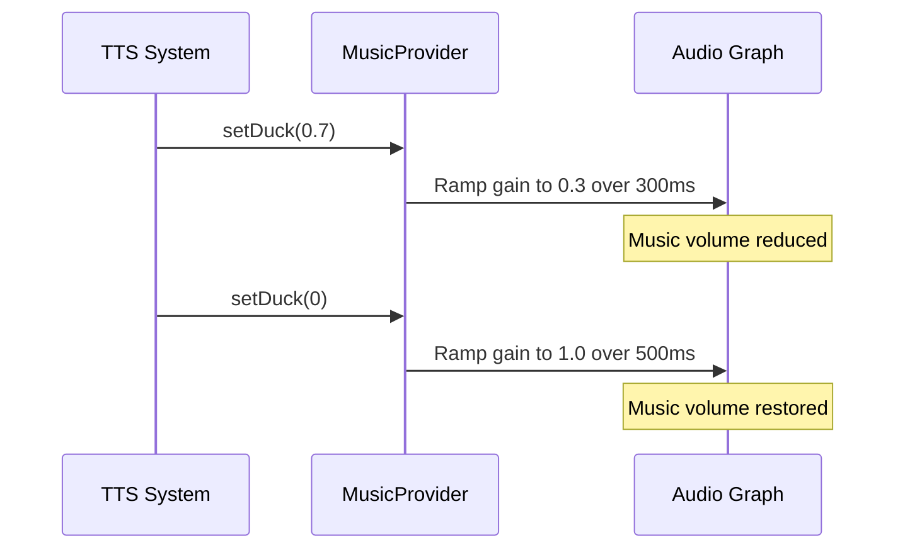
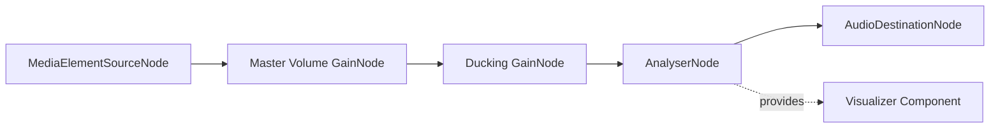
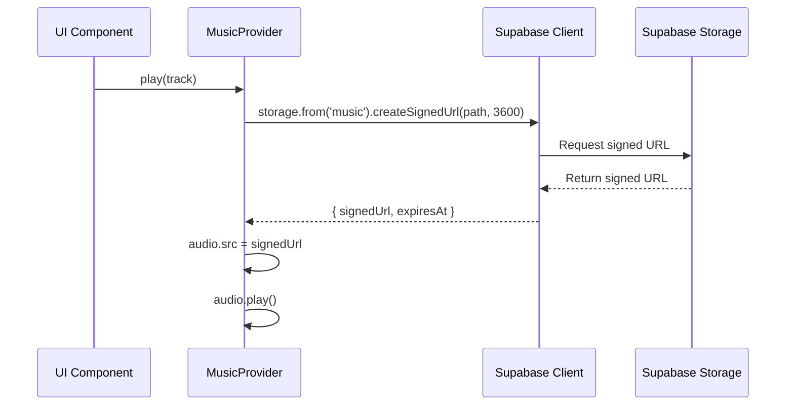
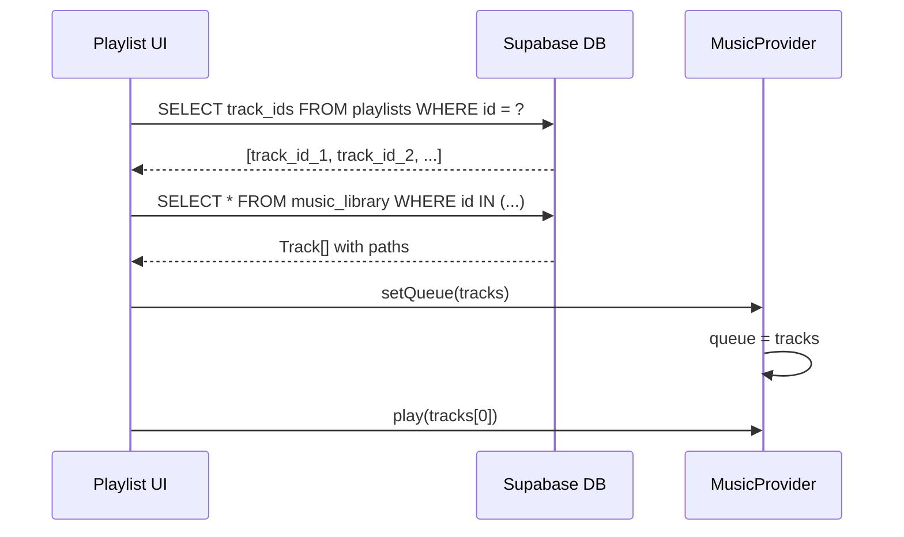
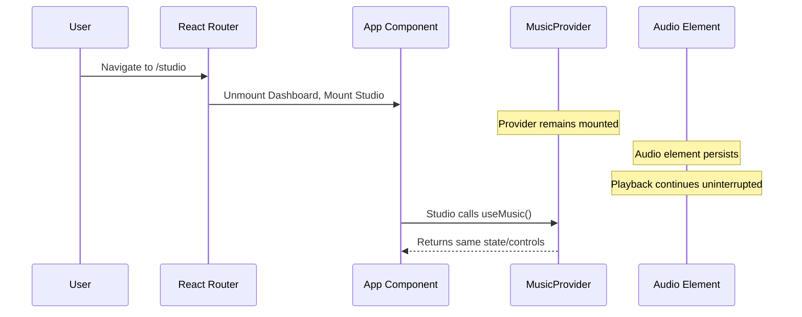

# Persistent Music Engine Design

## Overview

This design introduces a global, persistent music playback engine that survives route transitions and component unmounts throughout the application. Music stored in Supabase Storage will continue playing seamlessly when users navigate between Dashboard, Studio, and Media tabs. The engine centralizes all playback control, queue management, ducking, and visualization in a single React Context provider mounted at the application root.

**Core Value Proposition:**
- Uninterrupted music playback during navigation
- Single source of truth for audio state across all views
- Simplified integration via React Context API
- Proper handling of Supabase signed URLs with automatic refresh
- Foundation for advanced features (ducking, visualizer, queue auto-advance)

## Architecture

### Current State Analysis

The application currently has multiple audio players:

| Component/Hook | Scope | Lifecycle | Issue |
|----------------|-------|-----------|-------|
| `useAudioPlayer` | Component-scoped | Unmounts with component | Playback stops on navigation |
| `useDualDeckAudioPlayer` | App-level in `App.tsx` | Persists at root | Only for Studio DJ decks |
| `GlobalAudioManager` | Static class | Application lifetime | Only manages DJ deck elements |

**Problem:** General music playback (playlists, background music) is component-scoped and stops when navigating between tabs.

**Solution:** Lift music player to application root as a React Context Provider.

### Target Architecture



### Component Hierarchy



## Data Models

### Track Entity

| Field | Type | Description |
|-------|------|-------------|
| `id` | string | Unique track identifier |
| `path` | string | Supabase Storage bucket path |
| `title` | string (optional) | Display title |
| `artist` | string (optional) | Track artist |
| `duration` | number (optional) | Length in seconds |
| `mime` | string (optional) | MIME type (audio/mpeg, etc.) |
| `bpm` | number (optional) | Beats per minute (for future DJ features) |
| `key` | string (optional) | Musical key (for harmonic mixing) |

### Music Context State

| State | Type | Initial Value | Description |
|-------|------|---------------|-------------|
| `current` | Track \| undefined | undefined | Currently loaded track |
| `queue` | Track[] | [] | Playlist queue |
| `isPlaying` | boolean | false | Playback state |
| `currentTime` | number | 0 | Playback position (seconds) |
| `duration` | number | 0 | Track duration (seconds) |
| `volume` | number | 0.7 | Master volume (0.0-1.0) |
| `duckLevel` | number | 0 | Current ducking percentage (0-1) |

### Music Context API

| Method | Parameters | Returns | Description |
|--------|------------|---------|-------------|
| `play` | track?: Track | Promise\<void\> | Play track or resume current |
| `pause` | - | void | Pause playback |
| `resume` | - | Promise\<void\> | Resume paused track |
| `stop` | - | void | Stop and reset position |
| `seek` | seconds: number | void | Seek to position |
| `setQueue` | tracks: Track[] | void | Load new queue |
| `next` | - | Promise\<void\> | Skip to next track |
| `previous` | - | Promise\<void\> | Skip to previous track |
| `setVolume` | level: number | void | Set master volume |
| `setDuck` | percentage: number | void | Apply ducking (0=none, 1=full) |

## System Behavior

### Playback Lifecycle



### Signed URL Management

**Challenge:** Supabase signed URLs expire after a configured duration (typically 1 hour).

**Strategy:**
1. Generate fresh signed URL immediately before playback
2. Store expiry timestamp with each URL
3. Regenerate URL if expiry is within 5 minutes
4. Handle playback errors by attempting URL refresh once

| Event | Action | Rationale |
|-------|--------|-----------|
| `play(track)` | Generate signed URL → set as audio.src | Fresh URL ensures validity |
| URL expires during playback | Audio error fires → regenerate URL → resume | Seamless recovery |
| Long pause (>55 min) | Next play() regenerates URL | Prevents stale URL usage |

### Queue Auto-Advance

When a track ends naturally (not stopped/paused):



### Ducking Mechanism

**Purpose:** Temporarily reduce music volume when TTS speaks or sound effects play.

**Implementation:**
- Dedicated `GainNode` in Web Audio graph between source and destination
- Smooth volume ramps (300-500ms) to avoid jarring transitions

| Phase | Gain Value | Duration | Use Case |
|-------|------------|----------|----------|
| Normal | 1.0 | - | Music at full volume |
| Ducking | 0.3 | 300ms ramp | TTS speaking |
| Restore | 1.0 | 500ms ramp | TTS finished |



## Music Provider Implementation

### Provider Structure

The provider is a React component wrapping the entire application, initialized in `main.tsx`:

**Responsibilities:**
1. Create and manage single persistent `HTMLAudioElement`
2. Initialize Web Audio API graph (lazy-loaded on first play)
3. Manage playback queue and auto-advance logic
4. Handle Supabase signed URL generation and refresh
5. Expose `useMusic()` hook for consuming components

### Audio Element Lifecycle

**Creation:**
- Element created in `useEffect` on mount
- Attached to DOM (hidden) to ensure it persists
- Never destroyed until app unload

**Configuration:**

| Property | Value | Reason |
|----------|-------|--------|
| `preload` | 'auto' | Faster start on play() |
| `crossOrigin` | 'anonymous' | Required for Web Audio API |
| `preservesPitch` | true | Maintain quality during playback |

**Event Bindings:**

| Event | Handler Responsibility |
|-------|------------------------|
| `timeupdate` | Update currentTime state |
| `loadedmetadata` | Update duration state |
| `ended` | Trigger auto-advance or stop |
| `error` | Attempt URL refresh, fallback to error state |

### Web Audio Graph Topology



**Node Configuration:**

| Node | Type | Purpose | Configuration |
|------|------|---------|---------------|
| Source | MediaElementSourceNode | Connects HTMLAudioElement | Created from audio element |
| Volume | GainNode | Master volume control | Initial gain: 0.7 |
| Duck | GainNode | Dynamic volume reduction | Initial gain: 1.0 |
| Analyser | AnalyserNode | Frequency/waveform data | fftSize: 2048, smoothing: 0.8 |

### Supabase Integration Pattern

**URL Generation Flow:**



**Error Recovery:**

```mermaid
flowchart TD
    Play[audio.play() fails] --> CheckError{Error type?}
    CheckError -->|Network/403| RegenerateURL[Regenerate signed URL]
    RegenerateURL --> Retry[Retry play once]
    Retry --> Success{Success?}
    Success -->|Yes| Playing[Continue playback]
    Success -->|No| Error[Show error, log to console]
    CheckError -->|Other| Error
```

## Integration Points

### Removing Existing Component-Scoped Players

**Files to Modify:**

| File | Current State | Required Change |
|------|---------------|-----------------|
| `src/hooks/studio/useAudioPlayer.ts` | Creates local Audio element | Remove or mark deprecated |
| `src/pages/studio/StudioControlPanel.tsx` | Instantiates `useAudioPlayer()` | Replace with `useMusic()` |
| `src/components/studio/MusicPlayerControls.tsx` | Receives props from local player | Consume `useMusic()` directly |

### Provider Mounting Location

**Current App Structure:**

```tsx
// main.tsx
<BrowserRouter>
  <Routes>
    <Route path="/" element={<App />} />
    <Route path="/broadcast" element={<BroadcastOverlayView />} />
  </Routes>
</BrowserRouter>
```

**Target Structure with MusicProvider:**

```tsx
// main.tsx
<MusicProvider>
  <BrowserRouter>
    <Routes>
      <Route path="/" element={<App />} />
      <Route path="/broadcast" element={<BroadcastOverlayView />} />
    </Routes>
  </BrowserRouter>
</MusicProvider>
```

### Component Integration Pattern

**Before (Component-Scoped):**

```tsx
// StudioControlPanel.tsx
const audioPlayer = useAudioPlayer()

<MusicPlayerControls
  currentTrack={audioPlayer.currentTrack}
  isPlaying={audioPlayer.isPlaying}
  onPlay={audioPlayer.play}
  onPause={audioPlayer.pause}
/>
```

**After (Global Provider):**

```tsx
// Any component
const music = useMusic()

<button onClick={() => music.play(track)}>Play</button>
<button onClick={music.pause}>Pause</button>
<span>{Math.floor(music.currentTime)} / {Math.floor(music.duration)}</span>
```

### Dual Deck Coexistence

**Requirement:** The existing DJ dual deck system (`useDualDeckAudioPlayer`) must continue to work independently.

**Strategy:**
- `MusicProvider` handles general music/background/playlist playback
- `useDualDeckAudioPlayer` remains for professional DJ mixing (Deck A/B)
- No shared state between systems
- Both can play simultaneously (summed at destination)

**Clarification Table:**

| Use Case | System | Example |
|----------|--------|---------|
| Background music during show | MusicProvider | Playlist playback while talking |
| DJ mixing transition | Dual Deck | Crossfade between two tracks |
| Jingle/stinger playback | MusicProvider | Play intro jingle |
| Beat-matched mix | Dual Deck | Sync BPM on Deck A and B |

## Advanced Features (Foundation)

### Visualizer Integration

The `AnalyserNode` in the Web Audio graph provides real-time frequency/waveform data.

**Data Export:**

| Property | Type | Description |
|----------|------|-------------|
| `analyser` | AnalyserNode \| null | Exposed via context |
| `getByteFrequencyData()` | Uint8Array | Frequency spectrum (0-255) |
| `getByteTimeDomainData()` | Uint8Array | Waveform data (0-255) |

**Consumption Pattern:**

```typescript
const { analyser } = useMusic()

// In animation loop
const dataArray = new Uint8Array(analyser.frequencyBinCount)
analyser.getByteFrequencyData(dataArray)
// Render bars, waveform, etc.
```

### Queue Management

**Queue Operations:**

| Operation | Behavior |
|-----------|----------|
| `setQueue([track1, track2, ...])` | Replace entire queue |
| `addToQueue(track)` | Append to end |
| `removeFromQueue(index)` | Remove specific track |
| `clearQueue()` | Empty queue |
| Auto-advance | Automatic on track end |

**Shuffle Logic:**

| State | Behavior |
|-------|----------|
| `isShuffle = false` | Play queue in order |
| `isShuffle = true` | Randomize next track selection |

### Playlist Integration

**Loading from Supabase:**



**Playlist State Sync:**

The provider does not persist queue state to Supabase automatically. Components are responsible for:
1. Loading playlists from `playlists` table
2. Fetching track details from `music_library`
3. Calling `setQueue()` to hydrate provider
4. Optionally saving playback position to `audio_playback_state` table

## Navigation Continuity Mechanism

### Route Transition Flow



**Key Principle:** The `MusicProvider` is mounted **above** the router, ensuring it never unmounts during route changes.

### User Gesture Requirement

**Browser Autoplay Policy:** Audio playback requires a user gesture.

**Strategy:**
1. First `play()` call must be triggered by user interaction (click/tap)
2. Provider stores this gesture internally
3. Subsequent `play()` calls (auto-advance, resume) reuse the gesture

**Implementation:**

| Scenario | User Gesture Required? | Handling |
|----------|------------------------|----------|
| User clicks "Play" | Yes | Direct `audio.play()` call |
| Track ends, auto-advance | No | Uses existing playback context |
| User navigates tabs | No | Audio continues from existing playback |
| Fresh page load + autoplay | Yes | Wait for user interaction |

## Error Handling

### Error Scenarios

| Error | Cause | Recovery Strategy |
|-------|-------|-------------------|
| Signed URL expired | Long playback session (>1 hour) | Regenerate URL, retry once |
| Network failure | Connectivity loss | Display error, allow manual retry |
| Invalid track path | Database/storage mismatch | Skip to next track, log error |
| AudioContext suspended | Background tab/system policy | Resume on next interaction |
| CORS error | Misconfigured storage bucket | Log error, show setup instructions |

### Error State Communication

**Provider Error State:**

| Field | Type | Description |
|-------|------|-------------|
| `error` | string \| null | Human-readable error message |
| `hasError` | boolean | Error flag |
| `retryCount` | number | Attempts made for current operation |

**Error Display Pattern:**

```mermaid
flowchart TD
    Error[Error Occurs] --> SetState[Set error state in provider]
    SetState --> Notify[Components using useMusic() see error]
    Notify --> UI[Display error toast/banner]
    UI --> UserRetry{User retries?}
    UserRetry -->|Yes| ClearError[Clear error state]
    ClearError --> Attempt[Reattempt operation]
    UserRetry -->|No| Persist[Error persists in state]
```

## Testing Strategy

### Unit Testing

| Test Case | Validation |
|-----------|------------|
| Provider mounts successfully | Audio element created, context available |
| `play(track)` generates signed URL | Mock Supabase client, verify URL call |
| `pause()` stops playback | Audio element state checked |
| Queue auto-advance | Mock `ended` event, verify next track plays |
| Ducking applies gain | Verify GainNode value changes |
| Error recovery | Simulate URL expiry, verify retry |

### Integration Testing

| Scenario | Steps | Expected Result |
|----------|-------|-----------------|
| Navigation continuity | Play track → navigate to another tab → check playback | Music continues without interruption |
| Playlist loading | Load playlist → set queue → play first track | Queue populated, playback starts |
| Ducking during TTS | Play music → trigger TTS → verify volume dip | Music volume reduces then restores |
| Signed URL refresh | Play track → wait 61 min → seek/resume | New URL generated, playback resumes |

### Manual Testing Checklist

- [ ] Play track in Dashboard, navigate to Studio, verify music continues
- [ ] Play track in Studio, navigate to Media, verify music continues
- [ ] Load playlist, verify auto-advance to next track on end
- [ ] Test pause/resume across route changes
- [ ] Test seek functionality
- [ ] Test volume control
- [ ] Test ducking with `setDuck(0.5)` then `setDuck(0)`
- [ ] Test queue management (add, remove, reorder)
- [ ] Test error handling (invalid track, network error)
- [ ] Test on iOS Safari (autoplay policy)
- [ ] Test on Chrome desktop
- [ ] Verify no interference with dual deck DJ system

## Migration Path

### Phase 1: Provider Infrastructure

**Deliverables:**
1. Create `src/contexts/MusicProvider.tsx`
2. Implement `useMusic()` hook
3. Mount provider in `main.tsx`
4. Add Supabase signed URL integration
5. Implement audio element lifecycle
6. Add Web Audio graph initialization

### Phase 2: Component Refactoring

**Deliverables:**
1. Update `MusicPlayerControls` to consume `useMusic()`
2. Remove local player from `StudioControlPanel`
3. Update `Dashboard` music controls
4. Update `Media` page controls
5. Deprecate/remove old `useAudioPlayer` hook

### Phase 3: Advanced Features

**Deliverables:**
1. Implement queue auto-advance
2. Add ducking with smooth gain ramps
3. Expose analyser for visualizer
4. Add playlist integration
5. Implement error recovery for signed URLs

### Phase 4: Testing & Refinement

**Deliverables:**
1. Write unit tests for provider
2. Integration tests for navigation
3. Manual testing on all browsers
4. Performance profiling
5. Documentation updates

## Dependencies

### NPM Packages

| Package | Version | Purpose |
|---------|---------|---------|
| `react` | ^18.3.x | Context API |
| `@supabase/supabase-js` | Latest | Storage signed URLs |
| React Router | Existing | Navigation |

### Browser APIs

| API | Usage | Compatibility |
|-----|-------|---------------|
| HTMLAudioElement | Core playback | All modern browsers |
| Web Audio API | Effects, analyser | All modern browsers |
| MediaElementSourceNode | Audio graph integration | All modern browsers |

### Supabase Configuration

**Storage Bucket:**

| Setting | Value | Reason |
|---------|-------|--------|
| Bucket name | `music` | Dedicated music storage |
| Public access | Yes | Allows signed URLs |
| File size limit | 50MB | Reasonable for compressed audio |
| Allowed MIME types | `audio/*` | Audio files only |

**RLS Policies:**

| Policy | Rule | Purpose |
|--------|------|---------|
| Read access | Authenticated users | Secure signed URL generation |

## Performance Considerations

### Memory Management

| Resource | Strategy |
|----------|----------|
| Audio element | Single instance, reused across tracks |
| AudioContext | Created once, never destroyed |
| Queue | Limited to 1000 tracks maximum |
| Analyser data | Allocated once, reused in animation loop |

### Network Optimization

| Technique | Benefit |
|-----------|---------|
| Signed URL caching | Reduce API calls (regenerate only when expiring) |
| `preload='auto'` | Faster playback start |
| Progressive loading | Audio streams, no full download required |

### CPU Optimization

| Technique | Benefit |
|-----------|---------|
| Lazy AudioContext init | No overhead until first play |
| Throttled state updates | Avoid excessive re-renders |
| RAF-based visualizer | Smooth 60fps rendering |

## Security Considerations

### Signed URL Expiry

- URLs expire after 1 hour by default
- Regeneration on expiry prevents unauthorized long-term access
- No permanent public URLs stored

### Cross-Origin Resource Sharing

- `crossOrigin='anonymous'` on audio element
- Supabase storage CORS configured for app domain
- Prevents unauthorized domain access

### Input Validation

| Input | Validation |
|-------|------------|
| Track path | Must match `music_library.file_path` pattern |
| Volume level | Clamped to 0.0-1.0 range |
| Seek position | Clamped to 0-duration range |
| Duck percentage | Clamped to 0.0-1.0 range |

## Future Enhancements

### Potential Additions

| Feature | Description | Complexity |
|---------|-------------|------------|
| Crossfade | Smooth transition between tracks | Medium |
| EQ presets | Genre-based equalization | Medium |
| Gapless playback | Zero silence between tracks | High |
| Offline caching | Service Worker audio cache | High |
| Playback history | Track listening stats | Low |
| Smart shuffle | Avoid recent repeats | Medium |
| Collaborative queue | Multi-user playlist control | High |
| Lyrics sync | Time-synced lyrics display | Medium |
