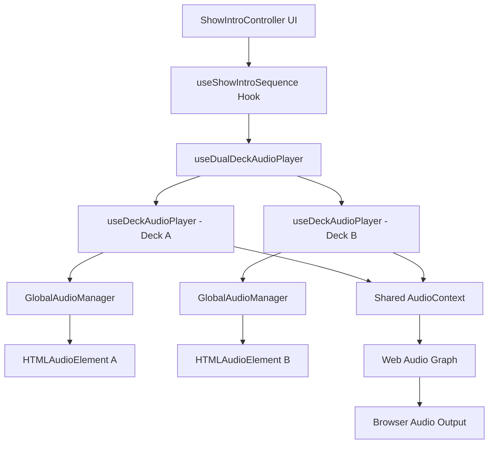
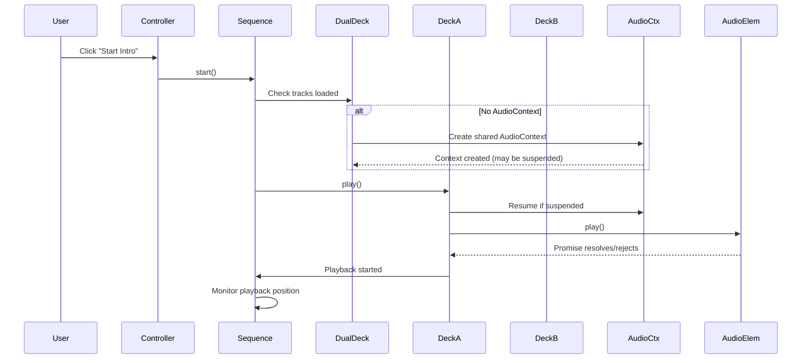

# Show Intro Audio Controller - Troubleshooting Design

## Overview

This document provides a systematic troubleshooting framework for diagnosing and resolving audio playback failures in the Show Intro Controller system. The controller orchestrates a complex automated sequence involving dual-deck audio playback, crossfading, game integration, and graphics synchronization.

**Purpose**: Enable diagnosis of audio playback issues through structured analysis of Web Audio API state, HTML5 audio elements, and async initialization workflows.

**Context**: The Show Intro Controller has experienced repeated audio playback failures despite multiple implementation attempts. Users report that audio does not play when the sequence is triggered.

## Architecture Overview

### Component Hierarchy



### Audio Signal Chain

The audio flows through multiple layers before reaching the browser's audio output:

| Layer | Component | Responsibility |
|-------|-----------|----------------|
| **Media Source** | HTMLAudioElement | Load and decode audio files, maintain playback position |
| **Audio Context** | Web AudioContext | Provide timing, routing, and processing capabilities |
| **Deck Processing** | useDeckAudioPlayer | Trim gain → 3-band EQ → Effects → Channel fader → Analyser |
| **Mixer** | useDualDeckAudioPlayer | Crossfader blend → Master gain → Limiter → Master analyser |
| **Output** | AudioContext.destination | Connect to system audio hardware |

## Critical Dependencies

### Initialization Sequence

The audio system requires careful initialization in a specific order:



### Browser Autoplay Policy Requirements

Modern browsers enforce strict autoplay policies that impact audio initialization:

| Requirement | Description | Failure Mode |
|-------------|-------------|--------------|
| **User Gesture** | AudioContext must be created or resumed after user interaction | AudioContext remains in 'suspended' state |
| **Document Visibility** | Page must be visible when play() is called | Play promise rejected with NotAllowedError |
| **No Prior Rejection** | Previous play() calls must not have failed | Subsequent play() calls may be blocked |
| **Media Session** | Audio element must have loaded metadata | play() fails with NotSupportedError |

## Known Issues and Root Causes

### Issue 1: AudioContext Suspended State

**Symptom**: Logs show "AudioContext state: suspended" and audio does not play.

**Root Cause**: The AudioContext is created during component mount (passive initialization) rather than during user interaction. Browsers suspend AudioContext instances created outside user gesture handlers.

**Detection Pattern**:
- AudioContext exists but state is 'suspended'
- Calling play() succeeds but no sound is heard
- Audio element shows paused: false but audio level is zero

**Resolution Strategy**:
- Always resume AudioContext immediately before first play() call
- Verify AudioContext.state === 'running' before proceeding
- Consider lazy initialization (create AudioContext only on first play)

### Issue 2: Audio Element Not Connected to Web Audio Graph

**Symptom**: Audio element plays (paused: false) but no sound reaches speakers.

**Root Cause**: The MediaElementAudioSourceNode is created but not properly connected through the audio graph to AudioContext.destination.

**Detection Pattern**:
- audio.paused === false
- audio.currentTime advances
- analyser shows no frequency data
- Output nodes disconnected or gain set to zero

**Connection Verification Chain**:

```mermaid
graph LR
    A[Audio Element] -->|createMediaElementSource| B[Source Node]
    B -->|connect| C[Trim Gain]
    C -->|connect| D[EQ Chain]
    D -->|connect| E[Effects Chain]
    E -->|connect| F[Channel Fader]
    F -->|connect| G[Deck Output]
    G -->|connect| H[Master Gain]
    H -->|connect| I[Limiter]
    I -->|connect| J[Analyser]
    J -->|connect| K[Destination]
    
    style A fill:#e1f5ff
    style K fill:#ffe1e1
```



**Each connection point must be verified**: Source exists → All nodes created → All connections established → Destination reachable

### Issue 3: Timing Race Condition in Async Initialization

**Symptom**: Sometimes audio plays, sometimes it doesn't, depending on load speed.

**Root Cause**: The play() method is called before AudioContext initialization completes, or before audio metadata is loaded.

**Detection Pattern**:
- Inconsistent behavior across attempts
- Success on slow networks/repeated attempts
- Failure on first load
- Console shows "AudioContext not initialized yet"

**Critical Async Checkpoints**:

| Checkpoint | Verification | Fallback |
|------------|--------------|----------|
| Audio element exists | audioRef.current !== null | Initialize audio element |
| Metadata loaded | audio.readyState >= 2 (HAVE_METADATA) | Wait for loadedmetadata event |
| AudioContext created | audioContextRef.current !== null | Call initializeAudioContext() |
| AudioContext running | ctx.state === 'running' | Await ctx.resume() |
| Source node connected | sourceNodeRef.current !== null | Rebuild audio graph |
| Track loaded | currentTrack !== null | Prevent play() |

### Issue 4: MediaElementAudioSourceNode Already Created

**Symptom**: Error "Failed to construct 'MediaElementAudioSourceNode': HTMLMediaElement already connected previously to a different MediaElementSourceNode"

**Root Cause**: Attempting to create multiple MediaElementAudioSourceNode instances for the same HTMLAudioElement.

**Detection Pattern**:
- Error thrown during initializeAudioContext()
- Audio graph initialization fails
- Occurs on component remount or hot reload

**Prevention Strategy**:
- Track whether source node has been created (use ref flag)
- Only create MediaElementAudioSourceNode once per audio element
- Reuse existing source node if AudioContext is reinitialized
- Use GlobalAudioManager to persist audio elements across component lifecycles

### Issue 5: Crossfader Gain Muting Playback

**Symptom**: Audio plays but volume is zero or very low.

**Root Cause**: Crossfader position sets deck output gain to near-zero.

**Detection Pattern**:
- Audio element playing (paused: false)
- Analyser shows activity at deck level
- Master analyser shows no activity
- Crossfader position at extreme (0 or 1)

**Gain Calculation Verification**:

For crossfader position `p` (0 = full A, 1 = full B):

| Curve Type | Deck A Gain Formula | Deck B Gain Formula |
|------------|---------------------|---------------------|
| Linear | 1 - p | p |
| Smooth (equal power) | cos((1 - (1-p)) * π/2) | cos((1 - p) * π/2) |
| Fast-cut | p < 0.4 ? 1.0 : (0.6-p)*5 | p > 0.6 ? 1.0 : (p-0.4)*5 |

**Expected State When Starting Song 1 (Deck A)**:
- Crossfader position: 0.0 (full A)
- Deck A output gain: ~1.0
- Deck B output gain: ~0.0

## Diagnostic Procedures

### Diagnostic 1: Comprehensive Audio State Inspection

**When to Use**: Before starting playback, when playback fails silently

**Inspection Points**:

```markdown
### Audio Element State
- audio.src: [URL or empty]
- audio.paused: [true/false]
- audio.currentTime: [number]
- audio.duration: [number or NaN]
- audio.volume: [0-1]
- audio.muted: [true/false]
- audio.readyState: [0-4] (target: 4 = HAVE_ENOUGH_DATA)
- audio.networkState: [0-3]
- audio.error: [null or MediaError]

### Web AudioContext State
- audioContext: [exists/null]
- audioContext.state: [suspended/running/closed]
- audioContext.destination: [exists/null]

### Audio Graph Nodes
- sourceNode: [exists/null]
- trimGainNode: [exists/null] → gain.value: [number]
- eqLowNode: [exists/null] → gain.value: [number]
- eqMidNode: [exists/null] → gain.value: [number]
- eqHighNode: [exists/null] → gain.value: [number]
- channelFaderNode: [exists/null] → gain.value: [number]
- outputNode: [exists/null] → gain.value: [number]
- masterGainNode: [exists/null] → gain.value: [number]

### Deck State
- currentTrack: [track object or null]
- isPlaying: [true/false]
- playbackPosition: [number]
- tempo: [number]

### Mixer State
- crossfaderPosition: [0-1]
- masterVolume: [0-1]
```

**Implementation**: The ShowIntroController includes a "Debug Audio" button that logs all these values.

### Diagnostic 2: Manual Play Test

**Purpose**: Bypass the orchestration logic and test raw audio playback capability.

**Procedure**:
1. Ensure tracks are loaded on both decks
2. Open browser console
3. Access deck directly: `window.deckA = dualDeck.deckA`
4. Attempt manual play: `await window.deckA.play()`
5. Check audio element directly: `window.deckA.audioElement.play()`
6. Monitor promise resolution/rejection

**Expected Outcomes**:

| Result | Interpretation | Next Step |
|--------|----------------|-----------|
| Manual play succeeds, sequence play fails | Orchestration logic issue | Review useShowIntroSequence step execution |
| Direct element play succeeds, deck play fails | Audio graph issue | Check Web Audio connections |
| All play attempts fail | Browser policy or resource issue | Check autoplay permissions, network errors |
| Play promise rejects | Specific error condition | Handle NotAllowedError, AbortError cases |

### Diagnostic 3: Incremental Initialization Test

**Purpose**: Verify each initialization step succeeds before proceeding.

**Step-by-Step Validation**:

```markdown
Step 1: Verify Audio Element Creation
- Check: audioRef.current !== null
- Check: audio element is instance of HTMLAudioElement
- Action: If missing, trigger GlobalAudioManager.getAudioElement()

Step 2: Load Track Metadata
- Check: audio.src is set to valid URL
- Check: audio.readyState >= 2 (HAVE_METADATA)
- Wait: For 'loadedmetadata' event if needed
- Check: audio.duration is finite number

Step 3: Initialize AudioContext
- Check: audioContextRef.current !== null
- Check: audioContext.state !== 'closed'
- Action: Create AudioContext if missing
- Action: Resume if suspended

Step 4: Create Audio Graph
- Check: All node refs are non-null
- Check: Source node connected to first node in chain
- Check: Final output node exists
- Verify: Output node will be connected by mixer

Step 5: Connect to Mixer
- Check: Deck output node connected to master gain
- Check: Master gain connected to limiter
- Check: Limiter connected to analyser
- Check: Analyser connected to destination

Step 6: Verify Gain Levels
- Check: No gain node has value of 0
- Check: Crossfader position appropriate for active deck
- Check: Master volume > 0
- Check: Channel fader > 0
```

**If any step fails**: Stop and resolve that step before proceeding.

### Diagnostic 4: Playback Promise Chain Analysis

**Purpose**: Track async promise resolution through the play sequence.

**Promise Chain**:

```markdown
1. start() called
   └─ Validates tracks loaded
      └─ Sets currentStep to 'song1_playing'
         └─ Triggers executeSong1Step()
            └─ Checks audioContext state
               └─ Resumes if suspended
                  └─ Calls deckA.play()
                     └─ Initializes AudioContext (if needed)
                        └─ Resumes AudioContext (if suspended)
                           └─ Calls audio.play()
                              └─ Returns Promise
```

**Failure Point Detection**:
- Add console.log before each async operation
- Wrap in try-catch to capture rejections
- Log promise resolution state
- Verify each promise completes before next step

### Diagnostic 5: User Interaction Timing Verification

**Purpose**: Confirm AudioContext initialization occurs within user gesture event handler.

**Verification**:
- AudioContext created during button click handler: ✓ Valid
- AudioContext created during useEffect on mount: ✗ May be suspended
- AudioContext.resume() called during button click: ✓ Valid
- AudioContext.resume() called in setTimeout: ✗ Invalid

**Test**: Click "Start Intro Sequence" → Immediately check `audioContext.state` in console. Must be 'running', not 'suspended'.

## Resolution Strategies

### Strategy 1: Guaranteed AudioContext Resume

**Approach**: Force AudioContext to running state immediately before every play() call.

**Implementation Locations**:
- useShowIntroSequence.executeSong1Step()
- useShowIntroSequence.executeCrossfadeStep()
- useShowIntroSequence.executeResumeStep()
- useDeckAudioPlayer.play()

**Pattern**:

```markdown
Before calling play():
1. Check if audioContext exists
2. If audioContext.state === 'suspended':
   - Await audioContext.resume()
   - Verify audioContext.state === 'running'
   - Log success/failure
3. Only then call audio.play()
4. Await play promise
5. Verify audio.paused === false
```

### Strategy 2: Lazy AudioContext Initialization

**Approach**: Defer AudioContext creation until first user interaction.

**Current State**: AudioContext is created during useDualDeckAudioPlayer initialization (on mount).

**Proposed State**: AudioContext is created during first play() call.

**Benefits**:
- AudioContext created within user gesture handler
- Avoids suspended state
- Reduces initialization overhead for unused features

**Risks**:
- Increased latency on first play
- Requires null checks throughout codebase

### Strategy 3: Explicit Connection Verification

**Approach**: After initializing audio graph, verify all connections are established.

**Verification Function**:

```markdown
Function: verifyAudioGraphConnected()

For Deck A:
1. Check sourceNode exists
2. Check all intermediate nodes exist
3. Check outputNode exists
4. Attempt to trace connection path programmatically
5. Log any disconnected nodes

For Mixer:
1. Check deckA.outputNode is connected
2. Check deckB.outputNode is connected
3. Check masterGainNode is connected
4. Check destination is reachable
```

**When to Call**:
- After initializeAudioContext()
- Before first play()
- After component remount
- When debugging audio issues

### Strategy 4: Playback Confirmation Loop

**Approach**: After calling play(), verify playback actually started.

**Verification Steps**:

```markdown
After calling audio.play():
1. Await promise resolution
2. Wait 100ms for state to stabilize
3. Check audio.paused === false
4. Check audio.currentTime > 0 and advancing
5. Check analyser shows non-zero frequency data
6. If any check fails:
   - Log failure state
   - Attempt recovery (re-initialize and retry)
   - Set error state for user visibility
```

### Strategy 5: Fallback to Direct Audio Element

**Approach**: If Web Audio API fails, bypass it and use HTMLAudioElement directly.

**When to Use**: After multiple Web Audio API failures.

**Implementation**:

```markdown
Fallback Mode:
1. Skip AudioContext initialization
2. Set audio element volume directly (no gain nodes)
3. Use audio element's native crossfade (volume ramps)
4. Disable EQ and effects
5. Log degraded mode for monitoring
```

**Trade-offs**:
- Loses EQ, effects, and analyser capabilities
- Simplifies initialization
- Higher success rate for basic playback
- Useful as emergency fallback

## Testing Strategy

### Test Case 1: Cold Start Playback

**Objective**: Verify audio plays on first attempt after page load.

**Preconditions**:
- Fresh page load
- No previous audio interaction
- Tracks pre-loaded on both decks

**Steps**:
1. Load page
2. Select Song 1 for Deck A
3. Select Song 2 for Deck B
4. Click "Start Intro Sequence"
5. Observe audio playback

**Success Criteria**:
- Song 1 begins playing within 500ms
- No console errors
- AudioContext state is 'running'
- Audio level visible in analyser

### Test Case 2: Resume After Stop

**Objective**: Verify sequence can be restarted after stopping.

**Steps**:
1. Start sequence
2. Allow to play for 10 seconds
3. Click "Stop"
4. Click "Start Intro Sequence" again

**Success Criteria**:
- Second start succeeds
- Playback position resets to 0
- No accumulated state issues

### Test Case 3: Cross-Tab Persistence

**Objective**: Verify audio continues when switching dashboard tabs.

**Steps**:
1. Start sequence
2. Switch to different dashboard tab
3. Wait 10 seconds
4. Return to Show Intro Controller tab

**Success Criteria**:
- Audio continues playing across tab switch
- Playback position accurate
- No audio dropouts

### Test Case 4: Multiple Deck Switches

**Objective**: Verify crossfader transitions work correctly.

**Steps**:
1. Start sequence
2. Manually move crossfader to center during Song 1
3. Manually move crossfader to full B
4. Return crossfader to A

**Success Criteria**:
- Both decks audible at center
- Smooth volume transitions
- No audio glitches or dropouts

### Test Case 5: Rapid Start/Stop Cycles

**Objective**: Verify no resource leaks or state corruption.

**Steps**:
1. Click "Start Intro Sequence"
2. Immediately click "Stop"
3. Repeat 10 times rapidly

**Success Criteria**:
- No console errors
- No memory leaks (check DevTools memory)
- Audio system remains functional
- Final playback attempt succeeds

## Monitoring and Observability

### Key Metrics to Track

| Metric | Collection Method | Alert Threshold |
|--------|------------------|-----------------|
| AudioContext initialization success rate | Log successful init vs failures | < 95% success |
| Time to first audio output | Measure from start() to first analyser activity | > 1000ms |
| AudioContext suspended state occurrences | Count resume() calls | > 1 per session |
| Play promise rejections | Catch and count rejected play() calls | > 0 per session |
| Audio graph connection failures | Count missing nodes during verification | > 0 |

### Debug Logging Strategy

**Log Levels**:

```markdown
Level 1 - Critical Path (Always On):
- Track loading
- Play/pause state changes
- Sequence step transitions
- AudioContext state changes
- Errors and exceptions

Level 2 - Diagnostic (Enable When Debugging):
- AudioContext initialization details
- Audio graph node creation
- Connection establishment
- Gain value changes
- Playback position updates

Level 3 - Verbose (Enable for Deep Debugging):
- Every event listener callback
- Every gain node value change
- Analyser data samples
- Crossfader position updates
- Beat counter ticks
```

**Current Implementation**: Most logs are Level 1, with Debug Audio button triggering Level 2 snapshot.

### Browser Console Inspection Guide

**Essential Console Commands**:

```markdown
# Check AudioContext state
dualDeck.audioContext.state

# Check if audio element is playing
dualDeck.deckA.audioElement.paused

# Get current playback position
dualDeck.deckA.audioElement.currentTime

# Check gain values
dualDeck.deckA.getOutputNode().gain.value

# Verify track loaded
dualDeck.deckA.currentTrack

# Manual play test
await dualDeck.deckA.play()

# Check crossfader
dualDeck.mixer.crossfaderPosition
```

## 🚨 EMERGENCY QUICK FIX (Apply Immediately)

### Critical Fix: Force AudioContext Resume Before Playback

**Problem**: AudioContext starts in 'suspended' state, preventing audio output.

**Solution**: Add explicit AudioContext resume in the start button click handler.

**Implementation Location**: ShowIntroController.tsx, in the "Start Intro Sequence" button's onClick handler.

**Required Changes**:

1. **In ShowIntroController.tsx, modify the Start button onClick**:

Change the onClick handler from:
```
onClick={() => {
  console.log('🎬 START BUTTON CLICKED')
  debugAudio()
  start()
}}
```

To:
```
onClick={async () => {
  console.log('🎬 START BUTTON CLICKED')
  
  // CRITICAL: Resume AudioContext BEFORE starting sequence
  if (dualDeck.audioContext) {
    if (dualDeck.audioContext.state === 'suspended') {
      console.log('⚠️ AudioContext suspended, resuming...')
      await dualDeck.audioContext.resume()
      console.log('✅ AudioContext state:', dualDeck.audioContext.state)
    }
  }
  
  // Also resume deck-level contexts
  if (dualDeck.deckA.audioContext?.state === 'suspended') {
    await dualDeck.deckA.audioContext.resume()
  }
  if (dualDeck.deckB.audioContext?.state === 'suspended') {
    await dualDeck.deckB.audioContext.resume()
  }
  
  debugAudio()
  start()
}}
```

2. **Verify both tracks are loaded before clicking Start**:
   - Ensure you see "READY" badge next to "Song Selection"
   - Both Deck A and Deck B must have tracks selected

3. **Click "Debug Audio" button BEFORE starting**:
   - Check console for "AudioContext state: suspended"
   - If suspended, the fix above will resolve it

**Expected Result After Fix**:
- Console shows: "✅ AudioContext state: running"
- Audio plays immediately when sequence starts
- No silent playback

**If This Doesn't Work**:
- Check console for "Audio element found" for both decks
- Verify "Ready State: 4" (HAVE_ENOUGH_DATA) for both audio elements
- Look for any red error messages in console
- Check that crossfader position is at 0.0 (full A)

### Backup Quick Fix: Direct Audio Element Test

If the above doesn't work, test direct playback:

1. Open browser DevTools console
2. Load tracks on both decks
3. Run this command:
```
await dualDeck.deckA.audioElement.play()
```
4. If you hear audio, the issue is in the orchestration logic
5. If you don't hear audio, check:
   - Browser tab is not muted (check speaker icon in tab)
   - System volume is up
   - Audio file URL is accessible (check Network tab)

### Emergency Fallback: Bypass Web Audio API

If Web Audio API continues to fail, use simple audio elements:

**In useShowIntroSequence.ts, modify executeSong1Step()**:

Replace the play logic with:
```
// Bypass Web Audio - use element directly
const audio = dualDeck.deckA.audioElement
if (audio) {
  audio.volume = 0.8 // Set volume directly
  await audio.play()
  console.log('✅ Direct playback started')
}
```

This loses EQ/effects but guarantees playback for the show.

## Recommended Immediate Actions

### Action 1: Add Pre-Play Validation Gate

Before calling audio.play() in useDeckAudioPlayer, add validation:

**Validation Checklist**:
- [ ] Audio element exists
- [ ] Audio element has valid src
- [ ] Audio element readyState >= 2
- [ ] AudioContext exists
- [ ] AudioContext state is 'running'
- [ ] Source node exists
- [ ] Output node exists
- [ ] Current track is loaded

If any validation fails, log error and prevent play() call.

### Action 2: Implement Automatic AudioContext Resume

In useShowIntroSequence.start(), before calling executeSong1Step():

**Resume Flow**:
1. Check both deck AudioContexts
2. If either is suspended, await resume() on both
3. Verify both reach 'running' state
4. Add timeout (5 seconds) for resume
5. If timeout, set error state
6. Only proceed if both running

### Action 3: Add Audio Element Readiness Wait

In useDeckAudioPlayer.loadTrack(), after setting audio.src:

**Wait for Metadata**:
1. Check audio.readyState
2. If < 2, create promise that resolves on 'loadedmetadata' event
3. Add timeout (10 seconds)
4. Await promise before returning from loadTrack()
5. This ensures play() is never called before metadata loaded

### Action 4: Verify Connections on Initialization

Add connection verification function to useDeckAudioPlayer:

**Verification Logic**:
- After creating all nodes
- Before returning from initializeAudioContext()
- Check each node is connected to next
- Log connection map
- Return success/failure boolean

### Action 5: Enhanced Error Reporting

Wrap all audio.play() calls in try-catch:

**Error Capture**:
- Catch promise rejection
- Identify error type (NotAllowedError, AbortError, etc.)
- Log full error details
- Set user-visible error message
- Provide recovery suggestions
