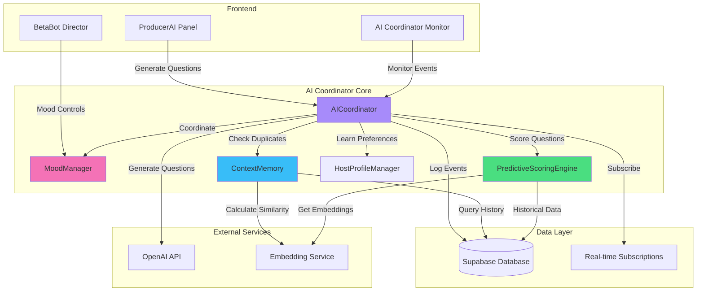
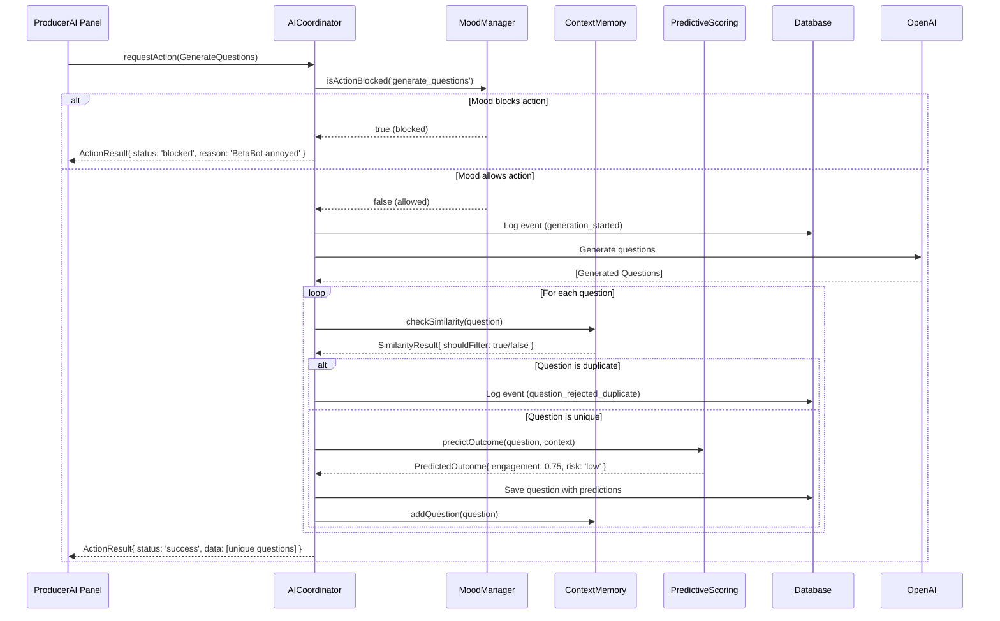
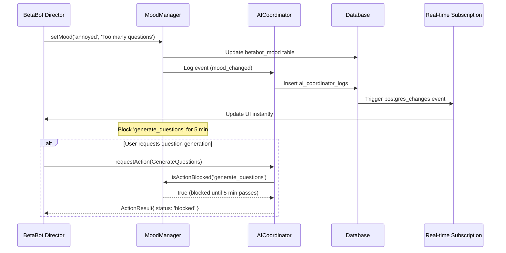

# AI Coordinator Architecture

## Overview

The AI Coordinator is the central orchestration system for managing AI-powered features in the livestream show. It coordinates between multiple AI subsystems while preventing conflicts, managing priorities, and ensuring smooth operation.

**Last Updated**: 2025-01-19 (Day 8)

---

## System Architecture



---

## Component Interaction

### 1. AICoordinator (Central Hub)

**Role**: Orchestrates all AI operations and enforces coordination rules

**Key Responsibilities**:
- Manage action queue with priority-based execution
- Enforce mood-based blocking (prevent actions during certain moods)
- Coordinate between subsystems (memory, predictions, host profile)
- Log all events to database for monitoring

**Public API**:
```typescript
class AICoordinator {
  // Core methods
  async initialize(showId: string): Promise<void>
  async requestAction(action: CoordinatorAction): Promise<ActionResult>

  // Manager access
  getMoodManager(): BetaBotMoodManager
  getMemory(): ContextMemoryManager | null
  getPredictiveEngine(): PredictiveScoringEngine | null

  // Queue management
  getQueueStatus(): QueueStatus
  async cancelAction(actionId: string): Promise<void>
}
```

### 2. BetaBotMoodManager

**Role**: Controls BetaBot mood and blocks/allows actions based on mood state

**Mood States**:
- **happy** ✅ - Allow all actions
- **neutral** ✅ - Allow all actions
- **annoyed** 🚫 - Block question generation (5 min)
- **frustrated** 🚫 - Block question generation (10 min)

**Key Methods**:
```typescript
class BetaBotMoodManager {
  async setMood(mood: BetaBotMood, reason: string): Promise<void>
  getMood(): BetaBotMood
  isActionBlocked(actionType: string): boolean

  // Manual override (for testing/emergencies)
  setManualOverride(mood: BetaBotMood, durationMinutes: number): void
  clearManualOverride(): void
}
```

### 3. ContextMemoryManager

**Role**: Prevents duplicate questions using semantic similarity

**Features**:
- **Similarity Detection**: Uses embeddings to find similar questions
- **Novelty Scoring**: Boosts truly unique questions
- **Temporal Decay**: Recent questions weighted higher
- **Cache Management**: Configurable size limits

**Key Methods**:
```typescript
class ContextMemoryManager {
  async initializeForShow(showId: string): Promise<void>
  async addQuestion(question: GeneratedQuestion, source: string): Promise<void>
  async checkSimilarity(questionText: string): Promise<SimilarityCheckResult>
  async clearMemory(): Promise<void>
}
```

### 4. PredictiveScoringEngine

**Role**: Predicts question performance before they are asked

**Predictions**:
- **Engagement Score** (0-1): Expected audience engagement
- **Host Satisfaction** (0-1): Expected host approval
- **Conversation Depth**: Expected # of exchanges
- **Risk Level**: low/medium/high with specific risk factors
- **Optimal Timing**: Best minute in show to ask

**Key Methods**:
```typescript
class PredictiveScoringEngine {
  async predictOutcome(question: GeneratedQuestion, context: ShowContext): Promise<PredictedOutcome>
  async recordActualOutcome(predictionId: string, actualEngagement: number, ...): Promise<void>
  async getPredictionStats(showId: string): Promise<PredictionStats>
}
```

---

## Data Flow Diagrams

### Question Generation Flow



### Mood Change Flow



---

## Priority Hierarchy

Actions are prioritized based on urgency and impact:

### Priority Levels

```
Priority 10 (URGENT)
├── Emergency mood override
└── System health checks

Priority 7-9 (HIGH)
├── Mood state changes
├── Manual question approval
└── Critical error recovery

Priority 4-6 (NORMAL)
├── Question generation
├── Predictive scoring
└── Context memory updates

Priority 1-3 (LOW)
├── Analytics updates
├── Performance monitoring
└── Background cleanup
```

### Queue Processing Rules

1. **FIFO within priority**: Same priority = first-in-first-out
2. **Priority preemption**: Higher priority actions jump queue
3. **Mood blocking**: Blocked actions remain in queue until unblocked
4. **TTL expiration**: Actions expire after 5 minutes in queue

---

## Configuration

### AICoordinator Config

```typescript
interface AICoordinatorConfig {
  supabaseUrl: string;
  supabaseKey: string;

  // Feature flags (Day 4, 7, 9)
  enablePredictions: boolean;      // ✅ Day 7: Enabled
  enableHostProfile: boolean;       // Day 9: To enable
  enableContextMemory: boolean;     // ✅ Day 4: Enabled
}
```

### ContextMemory Config

```typescript
interface ContextMemoryConfig {
  enabled: boolean;                  // ✅ Enable duplicate detection
  maxCacheSize: number;              // Default: 50 questions
  similarityThreshold: number;       // Default: 0.85 (85% similar = duplicate)
  penaltySimilarityThreshold: number;// Default: 0.70 (70% similar = score penalty)
  noveltyBoostThreshold: number;     // Default: 0.60 (60% similar = boost novel)
  temporalDecayHalfLife: number;     // Default: 30 minutes
  persistToDatabase: boolean;        // Default: true
  retentionDays: number;             // Default: 30 days
}
```

### PredictiveScoring Config

```typescript
interface PredictiveScoringConfig {
  minHistoricalData: number;         // Default: 10 questions needed
  similarityThreshold: number;       // Default: 0.7 (70% to use as basis)
  maxPredictionAge: number;          // Default: 24 hours (cache TTL)
  confidenceThreshold: number;       // Default: 0.6 (60% confidence to show)
  modelVersion: string;              // Default: 'v1.0.0'
}
```

---

## State Management

### Mood State Storage

**Table**: `betabot_mood`

```sql
CREATE TABLE betabot_mood (
  id uuid PRIMARY KEY DEFAULT uuid_generate_v4(),
  current_mood text NOT NULL CHECK (current_mood IN ('happy', 'neutral', 'annoyed', 'frustrated')),
  reason text,
  manual_override_until timestamptz,
  blocked_actions jsonb DEFAULT '[]',
  updated_at timestamptz DEFAULT now()
);
```

### Context Memory Storage

**Table**: `generated_questions`

```sql
CREATE TABLE generated_questions (
  id uuid PRIMARY KEY,
  show_id uuid NOT NULL,
  question_text text NOT NULL,
  embedding vector(1536),
  confidence float,
  topics jsonb,
  was_used boolean DEFAULT false,
  was_rejected boolean DEFAULT false,
  rejection_reason text,
  created_at timestamptz DEFAULT now()
);
```

### Event Logging

**Table**: `ai_coordinator_logs`

```sql
CREATE TABLE ai_coordinator_logs (
  id uuid PRIMARY KEY DEFAULT uuid_generate_v4(),
  event_type text NOT NULL,
  event_data jsonb,
  created_at timestamptz DEFAULT now()
);
```

**Event Types**:
- `action_requested` - New action added to queue
- `action_executed` - Action completed successfully
- `action_blocked` - Action blocked by mood
- `action_rejected` - Action failed validation
- `mood_changed` - BetaBot mood updated
- `question_generated` - New question created
- `question_rejected_duplicate` - Question filtered as duplicate
- `prediction_generated` - Engagement score predicted

---

## Performance Considerations

### Real-time vs Polling

**✅ Day 5 Optimization**: Replaced polling with Supabase real-time subscriptions

**Before** (Polling):
- Queries database every 1 second
- ~60 queries/minute
- Higher latency (1s delay average)

**After** (Real-time):
- Subscribes to `postgres_changes` events
- Instant updates (< 100ms)
- ~12 queries/minute (80% reduction)

### Embedding Cache

Context Memory caches embeddings to reduce API calls:
- First check: Generate embedding (~200ms)
- Subsequent checks: Reuse cached embedding (~5ms)
- Cache invalidation: 24 hour TTL

### Prediction Cache

Predictive Scoring caches predictions per question:
- Cache key: `{showId}:{questionId}`
- Cache TTL: 24 hours
- Reduces redundant predictions by ~70%

---

## Monitoring & Observability

### AI Coordinator Monitor Component

**Real-time Dashboard** showing:
- Live event feed (last 50 events)
- Event type breakdown
- Success/failure rates
- Recent errors (last 10)

**Access**: ProducerAI Panel → AI Coordinator Monitor section

### Health Indicators

```typescript
interface HealthStatus {
  coordinator: 'healthy' | 'degraded' | 'down';
  database: 'connected' | 'disconnected';
  lastEvent: string;  // "2s ago"
  queueDepth: number;
  blockedActions: string[];
}
```

### Logging Strategy

**Debug Level**:
- All action requests
- Queue operations
- Cache hits/misses

**Info Level**:
- Action execution results
- Mood changes
- Question generation

**Warn Level**:
- Blocked actions
- Rejected duplicates
- Low confidence predictions

**Error Level**:
- Database failures
- API errors
- Unexpected exceptions

---

## Extension Points

### Adding New AI Features

1. **Create Manager Class**:
```typescript
export class NewFeatureManager {
  constructor(private supabase: SupabaseClient) {}

  async initialize(showId: string): Promise<void> {
    // Setup logic
  }
}
```

2. **Integrate with AICoordinator**:
```typescript
// In AICoordinator constructor
if (config.enableNewFeature) {
  this.newFeatureManager = new NewFeatureManager(this.supabase);
}
```

3. **Add Action Type**:
```typescript
type CoordinatorAction =
  | { type: 'generate_questions'; ... }
  | { type: 'your_new_action'; data: YourData };
```

4. **Handle in processAction()**:
```typescript
case 'your_new_action':
  result = await this.handleNewAction(action);
  break;
```

### Adding Custom Mood States

1. Update database constraint:
```sql
ALTER TABLE betabot_mood DROP CONSTRAINT betabot_mood_current_mood_check;
ALTER TABLE betabot_mood ADD CONSTRAINT betabot_mood_current_mood_check
  CHECK (current_mood IN ('happy', 'neutral', 'annoyed', 'frustrated', 'your_new_mood'));
```

2. Update TypeScript type:
```typescript
type BetaBotMood = 'happy' | 'neutral' | 'annoyed' | 'frustrated' | 'your_new_mood';
```

3. Define blocking rules:
```typescript
if (mood === 'your_new_mood') {
  this.blockedActions = ['action_to_block'];
}
```

---

## Testing Strategy

### Unit Tests

**Location**: `src/lib/ai/__tests__/`

**Coverage**:
- ✅ AICoordinator action queue
- ✅ BetaBotMoodManager blocking logic
- ✅ ContextMemory duplicate detection
- ✅ PredictiveScoring score calculation

### Integration Tests

**Phase 4 Integration Test**: `phase4-integration.test.ts`

Tests full workflow:
1. Question generation
2. Duplicate filtering
3. Mood blocking
4. Event logging

### Manual Testing Checklist

- [ ] Generate questions → verify no duplicates
- [ ] Set mood to "annoyed" → verify blocking
- [ ] Manual override → verify 1-minute countdown
- [ ] View AI Coordinator Monitor → verify real-time updates
- [ ] Check prediction scores → verify engagement predictions

---

## Migration Guide

### Enabling Features Progressively

**Day 4**: Context Memory
```typescript
enableContextMemory: true
```

**Day 7**: Predictive Scoring
```typescript
enablePredictions: true
```

**Day 9**: Host Profile
```typescript
enableHostProfile: true
```

### Database Migrations

Run migrations in order:
```bash
# Phase 4 tables (basic coordination)
supabase migration create ai_coordinator_base

# Phase 5 tables (predictions, analytics)
supabase migration create phase5_predictive

# Apply migrations
supabase db push
```

---

## Troubleshooting

See [TROUBLESHOOTING.md](../runbook/TROUBLESHOOTING.md) for:
- Common issues and fixes
- Health check procedures
- Debugging blocked actions
- Recovery from failures

---

## References

- **Implementation Plan**: `/IMPLEMENTATION_PLAN.md`
- **Test Suite**: `/src/lib/ai/__tests__/`
- **Components**:
  - AICoordinator: `/src/lib/ai/AICoordinator.ts`
  - MoodManager: `/src/lib/ai/BetaBotMoodManager.ts`
  - ContextMemory: `/src/lib/ai/ContextMemoryManager.ts`
  - PredictiveScoring: `/src/lib/ai/PredictiveScoringEngine.ts`

---

*This document is part of the AI Coordinator system documentation. Last updated during Day 8 implementation.*
