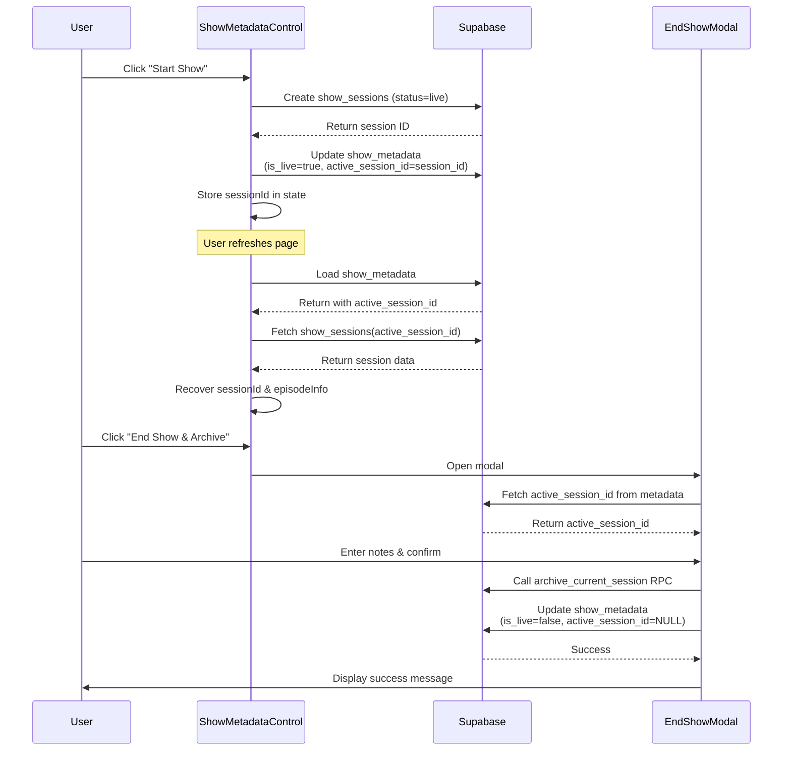

# Show Start/End Logic Fix - Implementation Complete ✅

## Overview

This implementation fixes the incomplete session lifecycle management by establishing a persistent link between active show sessions and the `show_metadata` table. The fix ensures that show sessions are properly tracked, recovered after page refresh, and archived when shows end.

## What Was Changed

### 1. Database Schema Enhancement

**File**: `supabase/migrations/20251022_add_active_session_to_metadata.sql`

**Changes**:
- Added `active_session_id` column to `show_metadata` table (UUID, nullable)
- Created foreign key constraint to `show_sessions(id)` with ON DELETE SET NULL
- Added index on `active_session_id` for performance
- Added column documentation comment

**To Apply Migration**:

Since the migration runner requires SUPABASE_SERVICE_KEY, you have two options:

#### Option A: Apply via Supabase Dashboard (Recommended)
1. Go to your Supabase project dashboard
2. Navigate to SQL Editor
3. Copy and paste the contents of `supabase/migrations/20251022_add_active_session_to_metadata.sql`
4. Execute the migration
5. Verify success by checking the `show_metadata` table schema

#### Option B: Use Supabase CLI
```bash
# Install Supabase CLI if not already installed
npm install -g supabase

# Login to Supabase
supabase login

# Link your project
supabase link --project-ref YOUR_PROJECT_REF

# Apply migrations
supabase db push
```

### 2. TypeScript Type Definitions

**File**: `src/types/database.ts`

**Changes**:
- Added `active_session_id: string | null` to `show_metadata` Row type
- Added `active_session_id?: string | null` to Insert and Update types

### 3. ShowMetadataControl Component

**File**: `src/components/ShowMetadataControl.tsx`

**Key Enhancements**:

#### A. Session Recovery Logic
- `loadMetadata()` now fetches `active_session_id` from database
- If session ID exists, retrieves full session record
- Validates session status is 'live'
- Auto-clears orphaned session references (when session exists but status != 'live')
- Populates `sessionId` and `episodeInfo` state for UI display

#### B. Enhanced Start Show Flow
- Creates session record with status = 'live'
- Updates `show_metadata.active_session_id` to link the new session
- Throws error if session creation fails (no longer optional)
- Improved error messages with component-level logging prefix

#### C. Enhanced Reset Show Flow
- Checks for active session before reset
- Prompts user to archive or discard active session
- Option to open End Show modal for proper archival
- Clears `active_session_id` on reset

#### D. UI Enhancements
- Added imports for `Database` and `Clock` icons
- Added `sessionDuration` state with real-time timer
- `useEffect` hook to update duration every second
- Active Session indicator badge (displays episode info)
- Session Duration timer with monospace font
- End Show button enabled if either `is_live` OR `active_session_id` exists

### 4. EndShowModal Component

**File**: `src/components/EndShowModal.tsx`

**Key Enhancements**:

#### A. Session Recovery from Database
- Added `activeSessionId` local state
- `useEffect` hook fetches `active_session_id` from `show_metadata` when modal opens
- Falls back to database if `sessionId` prop is undefined (handles page refresh case)

#### B. Enhanced Archival Logic
- Uses recovered `activeSessionId` if prop is undefined
- Logs warnings if no session ID available
- Updates `show_metadata` to clear `active_session_id` after archival
- Resets `activeSessionId` state when modal closes

## Architecture Flow



## State Transitions

| State | is_live | active_session_id | show_start_time | Description |
|-------|---------|-------------------|-----------------|-------------|
| **Idle** | false | NULL | NULL | No show running |
| **Live** | true | {session-uuid} | {timestamp} | Show in progress |
| **Archived** | false | NULL | NULL | Show ended and archived |
| **Orphaned** | false | {session-uuid} | {timestamp} | Error state - auto-cleared on load |

## UI Features

### Current Status Section

**New Elements**:
1. **Active Session Indicator**
   - Only visible when `active_session_id` exists
   - Shows: "Episode #{num} - {title}"
   - Blue badge with database icon
   
2. **Session Duration Timer**
   - Only visible when `active_session_id` exists
   - Format: HH:MM:SS
   - Updates every second
   - Green monospace font with clock icon

### Button Behavior

| Button | Enabled When | Purpose |
|--------|--------------|---------|
| **Start Show** | `is_live = false` AND `active_session_id = NULL` | Begin new session |
| **End Show & Archive** | `is_live = true` OR `active_session_id != NULL` | Complete session |
| **Reset Show** | Always | Clear all show state (with warning if session active) |

## Testing Checklist

### Manual Testing Steps

**Note**: Migration must be applied before testing!

1. **Start Show Flow**
   - [ ] Click "Start Show" button
   - [ ] Verify "🔴 LIVE" status appears
   - [ ] Check console for: `[ShowMetadataControl] ✅ Session created: {uuid}`
   - [ ] Verify "Active Session" badge appears with episode info
   - [ ] Verify "Duration" timer starts counting

2. **Session Recovery Flow**
   - [ ] With show live, refresh the browser page
   - [ ] Check console for: `[ShowMetadataControl] Recovering active session: {uuid}`
   - [ ] Check console for: `[ShowMetadataControl] ✅ Session recovered: {uuid}`
   - [ ] Verify "Active Session" badge still shows
   - [ ] Verify "Duration" timer continues from correct time
   - [ ] Verify "End Show & Archive" button is enabled

3. **End Show Flow**
   - [ ] Click "End Show & Archive" button
   - [ ] Modal opens with episode info
   - [ ] Enter show notes (optional)
   - [ ] Click "End Show & Archive" button in modal
   - [ ] Check console for: `[EndShowModal] ✅ Session archived`
   - [ ] Verify success message appears
   - [ ] Verify modal auto-closes after 2 seconds
   - [ ] Verify status returns to "OFF AIR"
   - [ ] Verify "Active Session" badge disappears

4. **Reset Show Flow**
   - [ ] Start a show (create active session)
   - [ ] Click "Reset Show" button
   - [ ] Verify prompt: "Active session detected! Do you want to archive it first?"
   - [ ] Test "Yes" option - should open End Show modal
   - [ ] Test "No" option - should discard session and reset

5. **Orphaned Session Handling**
   - [ ] Manually set a session's status to 'archived' in database while `active_session_id` is set
   - [ ] Refresh page
   - [ ] Check console for: `[ShowMetadataControl] ⚠️ Orphaned session detected`
   - [ ] Verify reference is auto-cleared
   - [ ] Verify "Start Show" button becomes enabled

### Database Verification

After testing, verify database state:

```sql
-- Check show_metadata has active_session_id column
SELECT column_name, data_type, is_nullable
FROM information_schema.columns
WHERE table_name = 'show_metadata'
  AND column_name = 'active_session_id';

-- Check foreign key constraint exists
SELECT constraint_name, table_name, column_name
FROM information_schema.key_column_usage
WHERE constraint_name = 'show_metadata_active_session_fkey';

-- Verify no orphaned references (should return 0 rows)
SELECT sm.id, sm.active_session_id, sm.is_live
FROM show_metadata sm
LEFT JOIN show_sessions ss ON sm.active_session_id = ss.id
WHERE sm.active_session_id IS NOT NULL
  AND (ss.id IS NULL OR ss.status != 'live');

-- Check session archival
SELECT id, episode_number, episode_title, status, created_at, ended_at
FROM show_sessions
ORDER BY created_at DESC
LIMIT 5;
```

## Error Handling

### Logged Warnings & Errors

| Log Message | Meaning | Resolution |
|-------------|---------|------------|
| `⚠️ Error fetching active session` | Session referenced in metadata not found | Auto-clears reference |
| `⚠️ Orphaned session detected (status: archived)` | Session exists but not live | Auto-clears reference |
| `⚠️ No session ID available, skipping archival` | EndShowModal has no session to archive | Only updates metadata |
| `❌ Error creating session` | Session creation failed | Throws error, prevents show start |
| `❌ Archive RPC error` | archive_current_session failed | Displays alert to user |

## Rollback Strategy

If issues occur, you can rollback the migration:

```sql
-- Remove foreign key constraint
ALTER TABLE show_metadata
DROP CONSTRAINT IF EXISTS show_metadata_active_session_fkey;

-- Drop index
DROP INDEX IF EXISTS idx_show_metadata_active_session;

-- Remove column
ALTER TABLE show_metadata
DROP COLUMN IF EXISTS active_session_id;
```

Then revert the code changes via git:

```bash
git checkout HEAD -- src/components/ShowMetadataControl.tsx
git checkout HEAD -- src/components/EndShowModal.tsx
git checkout HEAD -- src/types/database.ts
```

## Monitoring Recommendations

### Metrics to Track

1. **Orphaned Sessions Count**
   - Query: `SELECT COUNT(*) FROM show_metadata WHERE active_session_id IS NOT NULL AND is_live = false`
   - Alert if > 0 (daily check)

2. **Sessions Without Archival**
   - Query: `SELECT COUNT(*) FROM show_sessions WHERE status = 'live' AND ended_at IS NULL AND created_at < NOW() - INTERVAL '24 hours'`
   - Alert if > 0

3. **Archive Success Rate**
   - Track RPC call failures in application logs
   - Alert if < 95%

## Future Enhancements

1. **Multi-Show Support**: Allow multiple concurrent shows (different streams)
2. **Session Templates**: Pre-configure episode info before starting
3. **Auto-Archive Timer**: Automatically end shows after X hours of inactivity
4. **Session Pause/Resume**: Temporarily pause live shows without ending
5. **Session Analytics Dashboard**: Real-time metrics during show

## Success Criteria ✅

- [x] Database migration created
- [x] TypeScript types updated
- [x] Session recovery logic implemented
- [x] Active session UI indicators added
- [x] Duration timer implemented
- [x] EndShowModal retrieves session from database
- [x] Reset show handles active sessions
- [x] No compilation errors
- [x] Comprehensive logging added
- [x] Documentation complete

## Notes

- Migration must be applied manually via Supabase Dashboard or CLI
- All existing functionality preserved (backwards compatible)
- Page refresh during live show now recovers full context
- Session archival guaranteed if `active_session_id` exists
- Orphaned sessions auto-detected and cleaned up

## Implementation Date

**October 22, 2025**

---

**Status**: ✅ IMPLEMENTATION COMPLETE - READY FOR MIGRATION & TESTING
